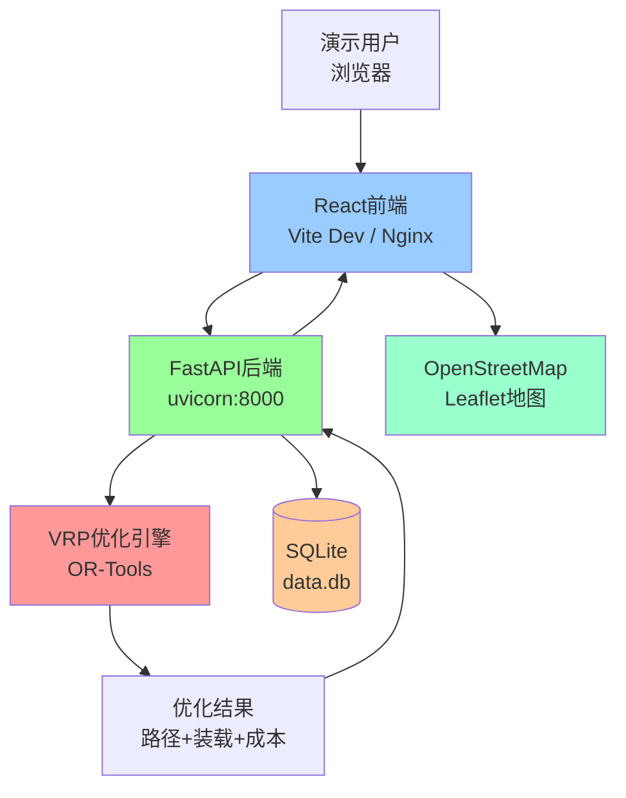
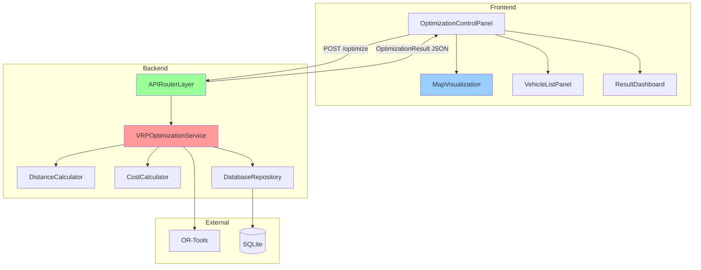

# AI自动配车系统演示原型 - 全栈架构文档

## Introduction

本文档概述了**AI自动配车系统演示原型**的完整全栈架构，包括后端AI优化引擎、前端演示界面及其集成方案。本文档作为AI驱动开发的唯一真实来源，确保整个技术栈的一致性。

该统一架构整合了传统上独立的后端与前端架构文档，简化了现代全栈应用的开发流程，特别适用于前后端紧密耦合的场景。

**项目背景：**
- **核心目标：** 验证AI自动配车功能对客户的价值，在实际运营条件下测试精度与性能
- **业务规模：**
  - 4个集货据点（20km范围内）
  - 100个配送目的地（50km范围内）
  - 10辆车辆（2t车×5，4t车×5）
  - 时间窗口限制（上午30%，下午70%）
- **验证重点：**
  1. 车辆装载优化（重量/容积）
  2. 运输成本计算（路线/距离/时间）
  3. UI/UX操作性
  4. 系统性能
  5. AI引擎能力
  6. AI判断根据与结果妥当性

### Starter Template or Existing Project

**项目基础：** 全新绿地项目（Greenfield Project）

**技术栈选择：** Python FastAPI + React

**选择理由：**
- **Python FastAPI后端** - 为AI/ML算法集成提供最佳支持，拥有丰富的优化库生态系统（OR-Tools、PuLP等）
- **React前端** - 强大的可视化能力，适合地图展示和交互式路径规划界面
- **快速开发** - 两者都支持快速原型开发和迭代
- **类型安全** - 可通过TypeScript（前端）和Pydantic（后端）实现端到端类型安全

**集成范围：** 本阶段专注于核心AI配车功能演示，暂不考虑外部系统集成。

### Change Log

| Date | Version | Description | Author |
|------|---------|-------------|---------|
| 2025-10-29 | 1.0 | 初始架构文档 - FastAPI + React 技术栈 | Winston (Architect) |
| 2025-10-30 | 1.1 | Review修复：①修复time_window约束 ②添加异步任务与进度API ③添加成本对比基线数据 ④统一缓存策略描述 | Winston (Architect) |

---

## High Level Architecture

### Technical Summary

**AI自动配车系统演示原型**采用现代全栈架构，结合Python后端的AI计算能力与React前端的交互可视化优势。系统采用**前后端分离的RESTful API架构**，通过JSON进行数据交换。后端使用FastAPI框架实现高性能异步API服务，集成车辆路径优化算法（VRP - Vehicle Routing Problem）引擎。前端采用React + TypeScript构建单页应用（SPA），使用Leaflet进行地图可视化，实时展示配送路径优化结果。整体部署采用**Docker Compose本地容器化方案**，完全零成本运行。该架构实现了PRD目标：通过直观的UI展示AI配车的效率提升与成本优化能力。

### Platform and Infrastructure Choice

**平台选择：** Docker本地部署（完全零成本方案）

**核心服务：**
- **后端服务：** FastAPI应用（Docker容器，Python 3.11）
- **前端服务：** React应用（Nginx静态托管，生产模式）
- **数据存储：** SQLite 3（单文件数据库，零配置）
- **缓存层：** 内存缓存（可选，演示场景可省略）
- **地图服务：** OpenStreetMap + Leaflet（完全免费开源）
- **路由计算：** 简化距离计算（Haversine公式，可选升级为OSRM）

**部署区域：** 本地开发环境（支持离线演示）

**零成本技术选型理由：**
- 所有组件均为开源免费
- 无需云服务费用
- 无需地图API密钥
- 无需数据库容器（SQLite内嵌）
- 极简部署（甚至无需Docker，可直接运行）
- 支持完全离线运行（预加载地图数据）

### Repository Structure

**结构类型：** 简单Monorepo（单仓库，文件夹分离）

**Monorepo工具：** 无需工具（使用简单的文件夹组织）

**包组织策略：**
```
ai-vehicle-routing/
├── frontend/          # React应用
├── backend/           # FastAPI应用
├── shared/            # 共享类型定义（Pydantic schemas可导出为TypeScript）
├── docker/            # Docker配置文件
└── data/              # 测试数据（100个配送点、4个据点、10辆车）
```

### High Level Architecture Diagram



**组件说明：**
- 可选Docker部署或直接本地运行（Python + Node.js）
- 前端开发模式使用Vite Dev Server，生产模式可用Nginx
- VRP引擎同步/异步计算（取决于复杂度）
- SQLite数据库文件存储在backend/data/目录
- 地图瓦片可预缓存实现离线演示

### Architectural Patterns

本系统采用以下架构模式：

- **RESTful API架构：** 前后端通过标准HTTP/JSON通信 - _理由：_ 简单、成熟、易于调试和演示
- **Component-Based UI (React)：** 可复用的UI组件（地图、车辆列表、结果面板） - _理由：_ 提高开发效率和界面一致性
- **Repository Pattern (后端)：** 数据访问层抽象（VehicleRepository、DeliveryRepository） - _理由：_ 便于测试和模拟数据
- **Service Layer Pattern：** 业务逻辑与API层分离（VRPService、RouteService） - _理由：_ VRP计算逻辑独立，可单元测试
- **Async/Await异步处理：** FastAPI异步端点处理长时计算 - _理由：_ 避免阻塞API，提升响应性
- **In-Memory Caching (lru_cache)：** Python标准库functools.lru_cache缓存计算结果 - _理由：_ 零依赖，演示场景无需Redis等外部缓存服务
- **Factory Pattern (VRP引擎)：** 支持多种算法切换（贪心/遗传/精确） - _理由：_ 便于演示不同AI引擎效果对比
- **Strategy Pattern (成本计算)：** 可插拔的成本计算策略（距离/时间/综合） - _理由：_ 演示灵活性

---

## Tech Stack

以下是项目的**唯一技术选型真实来源**，所有开发必须严格遵循此表。基于零成本和演示原型的特性，采用完全开源免费的技术栈。

### Technology Stack Table

| Category | Technology | Version | Purpose | Rationale |
|----------|-----------|---------|---------|-----------|
| **Frontend Language** | TypeScript | 5.3+ | 前端类型安全语言 | 提供编译时类型检查，减少运行时错误，与后端Pydantic形成端到端类型安全 |
| **Frontend Framework** | React | 18.2+ | UI框架 | 成熟稳定，组件生态丰富，适合地图可视化和复杂交互 |
| **UI Component Library** | Ant Design | 5.12+ | UI组件库 | 开源免费，企业级设计，组件完善（Table、Form、Layout等），中文支持优秀 |
| **State Management** | Zustand | 4.4+ | 轻量状态管理 | API简洁，性能优秀，无需Redux复杂配置，适合中小型应用 |
| **Frontend Routing** | React Router | 6.20+ | 客户端路由 | React官方推荐，支持嵌套路由和懒加载 |
| **地图可视化** | Leaflet | 1.9+ | 开源地图库 | 零成本，轻量级（39KB），支持OpenStreetMap，插件生态丰富 |
| **HTTP Client** | Axios | 1.6+ | HTTP请求库 | 支持拦截器、请求取消、自动JSON转换 |
| **Backend Language** | Python | **3.11（厳密）** | 后端语言 | 丰富的科学计算库，OR-Tools原生支持，异步性能优秀。⚠️ **重要：必须使用3.11仮想環境，3.12+では OR-Tools が動作しません** |
| **Backend Framework** | FastAPI | 0.109+ | 异步API框架 | 高性能，自动生成OpenAPI文档，原生async/await支持，类型提示友好 |
| **API Style** | REST API | - | HTTP JSON API | 简单成熟，易于调试，浏览器直接可测试 |
| **数据验证** | Pydantic | 2.5+ | 数据模型验证 | FastAPI原生集成，自动JSON序列化，可导出TypeScript类型 |
| **Database** | SQLite | 3.40+ | 嵌入式数据库 | 零配置，单文件存储，演示数据量（<1000条）完全够用，无需额外容器 |
| **ORM** | SQLAlchemy | 2.0+ | Python ORM | 成熟稳定，支持异步，SQLite原生支持，类型提示友好 |
| **Cache** | Python lru_cache | - | 内存缓存 | 标准库functools.lru_cache，零依赖，适合缓存VRP计算结果 |
| **File Storage** | 本地文件系统 | - | 静态文件存储 | 演示场景无需对象存储，测试数据CSV/JSON直接存储 |
| **Authentication** | 不需要 | - | - | 演示场景单用户，可省略认证系统 |
| **VRP优化引擎** | OR-Tools | 9.8+ | 车辆路径优化 | Google开源，工业级性能，支持容量约束、时间窗口、多车场CVRPTW |
| **距离计算** | Haversine公式 | - | 地理距离计算 | 简单高效，适合演示场景，精度满足要求（误差<1%） |
| **前端构建工具** | Vite | 5.0+ | 前端构建 | 极快的开发服务器（<200ms启动），HMR即时热更新，生产构建优化 |
| **前端测试** | Vitest + RTL | 1.1+ | 单元/组件测试 | Vite原生集成，兼容Jest API，React Testing Library适合组件测试 |
| **后端测试** | Pytest | 7.4+ | Python测试框架 | 简洁语法，丰富插件（pytest-asyncio、pytest-cov） |
| **E2E Testing** | Playwright | 1.40+ | 端到端测试 | 跨浏览器测试，可录制测试脚本，适合演示验收测试 |
| **代码检查** | ESLint + Ruff | - | 代码质量工具 | ESLint（前端），Ruff（后端，Rust编写，极快） |
| **代码格式化** | Prettier + Black | - | 代码格式化 | Prettier（前端），Black（后端），统一代码风格 |
| **容器化** | Docker (可选) | 24+ | 容器引擎 | 可选使用，演示可直接运行Python+Node.js环境 |
| **容器编排** | Docker Compose (可选) | 2.23+ | 本地编排 | 可选使用，简化多服务启动 |
| **版本控制** | Git | 2.40+ | 代码版本管理 | 行业标准 |
| **API文档** | Swagger UI | - | API文档 | FastAPI自动生成，交互式测试界面 |
| **前端图表** | Recharts | 2.10+ | 数据可视化 | React组件化图表库，展示成本对比、装载率等指标 |

### 技术栈设计决策说明

**SQLite vs PostgreSQL 的选择：**

| 对比项 | SQLite | PostgreSQL |
|--------|--------|------------|
| **部署复杂度** | ✅ 零配置，单文件 | ❌ 需要容器/服务 |
| **演示数据量** | ✅ <100万条完全够用 | ⚠️ 杀鸡用牛刀 |
| **成本** | ✅ 零成本，零维护 | ⚠️ 需要资源 |
| **地理查询** | ⚠️ 无PostGIS | ✅ 原生GIS支持 |
| **并发写入** | ⚠️ 单写入锁 | ✅ MVCC高并发 |
| **演示场景适用性** | ✅✅✅ 完美 | ⚠️ 过度设计 |

**理由：** 演示场景下只有100个配送点的数据，SQLite的性能和功能完全满足需求。地理计算可以用简单的Haversine公式实现，无需PostGIS。

**零成本关键技术选择：**
1. **OR-Tools** - 完全免费，工业级性能，支持复杂CVRPTW（容量+时间窗口VRP）
2. **Leaflet + OpenStreetMap** - 开源无限制，无需API密钥
3. **SQLite** - 零配置，零维护，零成本
4. **lru_cache** - Python标准库，无需Redis容器
5. **Haversine公式** - 简单准确，无需路由API

**极简部署的优势：**
- **无需Docker** - 可直接运行 `pip install` + `npm install`
- **单命令启动** - `python run.py` + `npm run dev`
- **零外部依赖** - 无需数据库服务、缓存服务
- **离线演示** - 所有数据本地存储，无需网络

---

## Data Models

以下是系统的核心数据模型，这些模型在前后端之间共享，确保数据一致性。

### Depot（集货据点）

**Purpose:** 表示车辆的起始和返回位置，用于多据点配车场景

**Key Attributes:**
- `id`: string - 据点唯一标识符
- `name`: string - 据点名称
- `latitude`: number - 纬度坐标
- `longitude`: number - 经度坐标
- `address`: string - 详细地址
- `operating_hours`: object - 营业时间（start_time, end_time）

#### TypeScript Interface

```typescript
interface Depot {
  id: string;
  name: string;
  latitude: number;
  longitude: number;
  address: string;
  operating_hours: {
    start_time: string; // HH:MM格式
    end_time: string;
  };
}
```

#### Relationships
- 一个Depot可以有多个Vehicle
- 一个Depot可以作为多条Route的起点/终点

---

### Vehicle（车辆）

**Purpose:** 表示配送车辆及其容量约束

**Key Attributes:**
- `id`: string - 车辆唯一标识符
- `vehicle_type`: string - 车辆类型（"2t" | "4t"）
- `capacity_weight`: number - 最大载重（千克）
- `capacity_volume`: number - 最大容积（立方米）
- `depot_id`: string - 所属据点ID
- `available_hours`: object - 可用时间段
- `cost_per_km`: number - 每公里成本（日元）
- `cost_per_hour`: number - 每小时成本（日元）

#### TypeScript Interface

```typescript
type VehicleType = "2t" | "4t";

interface Vehicle {
  id: string;
  vehicle_type: VehicleType;
  capacity_weight: number; // kg
  capacity_volume: number; // m³
  depot_id: string;
  available_hours: {
    start_time: string; // HH:MM
    end_time: string;
  };
  cost_per_km: number; // ¥/km
  cost_per_hour: number; // ¥/hour
}
```

#### Relationships
- 属于一个Depot
- 分配到一条Route

---

### Delivery（配送目的地）

**Purpose:** 表示配送任务及其约束条件

**Key Attributes:**
- `id`: string - 配送点唯一标识符
- `customer_name`: string - 客户名称
- `latitude`: number - 纬度坐标
- `longitude`: number - 经度坐标
- `address`: string - 详细地址
- `package_count`: number - 伴票枚数（1-3枚）
- `weight`: number - 货物重量（千克）
- `volume`: number - 货物体积（立方米）
- `time_window`: object - 时间窗口（"morning" | "afternoon" | null）
- `service_time`: number - 服务时间（分钟）

#### TypeScript Interface

```typescript
type TimeWindow = "morning" | "afternoon" | null;

interface Delivery {
  id: string;
  customer_name: string;
  latitude: number;
  longitude: number;
  address: string;
  package_count: number; // 1-3
  weight: number; // kg
  volume: number; // m³
  time_window: TimeWindow;
  service_time: number; // minutes
}
```

#### Relationships
- 分配到一条Route
- 按顺序排列在RouteStop中

---

### Route（配送路线）

**Purpose:** 表示优化后的车辆配送路线

**Key Attributes:**
- `id`: string - 路线唯一标识符
- `vehicle_id`: string - 分配车辆ID
- `depot_id`: string - 起始据点ID
- `stops`: array - 配送停靠点序列
- `total_distance`: number - 总距离（千米）
- `total_duration`: number - 总时长（分钟）
- `total_weight`: number - 总载重（千克）
- `total_volume`: number - 总容积（立方米）
- `total_cost`: number - 总成本（日元）

#### TypeScript Interface

```typescript
interface RouteStop {
  delivery_id: string;
  sequence: number; // 停靠顺序
  arrival_time: string; // ISO 8601
  departure_time: string;
  distance_from_previous: number; // km
  duration_from_previous: number; // minutes
}

interface Route {
  id: string;
  vehicle_id: string;
  depot_id: string;
  stops: RouteStop[];
  total_distance: number; // km
  total_duration: number; // minutes
  total_weight: number; // kg
  total_volume: number; // m³
  total_cost: number; // ¥
  utilization_weight: number; // 0-100%
  utilization_volume: number; // 0-100%
}
```

#### Relationships
- 属于一个Vehicle
- 起始于一个Depot
- 包含多个RouteStop（每个关联一个Delivery）

---

### OptimizationRequest（优化请求）

**Purpose:** 表示VRP优化请求及其参数

**Key Attributes:**
- `id`: string - 请求唯一标识符
- `depot_ids`: array - 使用的据点ID列表
- `vehicle_ids`: array - 使用的车辆ID列表
- `delivery_ids`: array - 配送点ID列表
- `optimization_strategy`: string - 优化策略（"distance" | "time" | "cost"）
- `algorithm`: string - 算法选择（"greedy" | "genetic" | "exact"）
- `created_at`: string - 创建时间

#### TypeScript Interface

```typescript
type OptimizationStrategy = "distance" | "time" | "cost";
type Algorithm = "greedy" | "genetic" | "exact";

interface OptimizationRequest {
  id: string;
  depot_ids: string[];
  vehicle_ids: string[];
  delivery_ids: string[];
  optimization_strategy: OptimizationStrategy;
  algorithm: Algorithm;
  created_at: string; // ISO 8601
}
```

---

### OptimizationResult（优化结果）

**Purpose:** 表示VRP优化计算的结果，包含优化前的基线指标用于对比

**Key Attributes:**
- `id`: string - 结果唯一标识符
- `request_id`: string - 关联的请求ID
- `routes`: array - 优化后的路线列表
- `total_distance`: number - 总距离
- `total_duration`: number - 总时长
- `total_cost`: number - 总成本
- `computation_time`: number - 计算耗时（毫秒）
- `unassigned_deliveries`: array - 未分配的配送点
- `baseline_metrics`: object - **优化前基线指标（用于对比）**
- `improvement_metrics`: object - **改善指标（优化前后对比）**
- `created_at`: string - 创建时间

#### TypeScript Interface

```typescript
interface BaselineMetrics {
  total_distance: number;  // 基线总距离（贪心算法或简单分配）
  total_duration: number;  // 基线总时长
  total_cost: number;  // 基线总成本
  average_utilization_weight: number;  // 基线平均装载率
  method: string;  // 基线计算方法（"greedy" | "simple_assignment"）
}

interface ImprovementMetrics {
  distance_reduction_km: number;  // 距离削减（km）
  distance_reduction_percent: number;  // 距离削减率（%）
  duration_reduction_minutes: number;  // 时长削减（分钟）
  cost_reduction_amount: number;  // 成本削减金额（¥）
  cost_reduction_percent: number;  // 成本削减率（%）
  utilization_improvement_percent: number;  // 装载率改善（%）
}

interface OptimizationResult {
  id: string;
  request_id: string;
  routes: Route[];
  total_distance: number; // km
  total_duration: number; // minutes
  total_cost: number; // ¥
  average_utilization_weight: number; // %
  average_utilization_volume: number; // %
  computation_time: number; // ms
  unassigned_deliveries: string[]; // delivery IDs
  baseline_metrics: BaselineMetrics;  // 基线指标
  improvement_metrics: ImprovementMetrics;  // 改善指标
  created_at: string; // ISO 8601
}
```

---

## API Specification

系统采用REST API架构，所有端点返回JSON格式数据。以下是完整的API规范。

### 核心API端点

| 端点 | 方法 | 功能 | 说明 |
|------|------|------|------|
| `/api/v1/depots` | GET | 获取据点列表 | 返回所有集货据点 |
| `/api/v1/vehicles` | GET | 获取车辆列表 | 可按depot_id过滤 |
| `/api/v1/deliveries` | GET | 获取配送点列表 | 可按time_window过滤 |
| `/api/v1/deliveries` | POST | 批量导入配送点 | 支持CSV/JSON导入 |
| `/api/v1/optimization/optimize` | POST | **执行VRP优化（异步）** | **返回任务ID，支持轮询状态** |
| `/api/v1/optimization/tasks/{task_id}` | GET | **获取优化任务状态** | **返回进度、阶段、结果（完成时）** |
| `/api/v1/optimization/results/{id}` | GET | 获取优化结果 | 查看历史优化记录 |
| `/api/v1/routes/{id}` | GET | 获取路线详情 | 单条路线详细信息 |
| `/api/v1/seed/demo-data` | POST | 初始化演示数据 | 4据点+10车+100点 |

### 核心API详细说明

#### POST /api/v1/optimization/optimize（VRP优化 - 异步任务）

**Request Body:**
```json
{
  "depot_ids": ["depot-1", "depot-2", "depot-3", "depot-4"],
  "vehicle_ids": ["vehicle-1", "vehicle-2", ..., "vehicle-10"],
  "delivery_ids": ["delivery-1", ..., "delivery-100"],
  "optimization_strategy": "cost",  // "distance" | "time" | "cost"
  "algorithm": "genetic"  // "greedy" | "genetic" | "exact"
}
```

**Response (202 Accepted):**
```json
{
  "task_id": "task-abc-123",
  "status": "queued",
  "message": "优化任务已创建，请轮询 /api/v1/optimization/tasks/task-abc-123 查看进度",
  "created_at": "2025-10-29T08:00:00Z"
}
```

---

#### GET /api/v1/optimization/tasks/{task_id}（获取任务状态与进度）

**Response (200 OK) - 任务进行中：**
```json
{
  "task_id": "task-abc-123",
  "status": "processing",  // "queued" | "processing" | "completed" | "failed"
  "progress": 75,  // 0-100
  "current_stage": "计算路线中...",  // 阶段描述
  "stages": [
    {"name": "分析配送点", "status": "completed"},
    {"name": "构建距离矩阵", "status": "completed"},
    {"name": "执行VRP优化", "status": "processing"},
    {"name": "生成结果", "status": "pending"}
  ],
  "started_at": "2025-10-29T08:00:01Z",
  "estimated_completion": "2025-10-29T08:00:05Z"
}
```

**Response (200 OK) - 任务完成：**
```json
{
  "task_id": "task-abc-123",
  "status": "completed",
  "progress": 100,
  "current_stage": "优化完成",
  "result": {
    "id": "opt-result-123",
    "request_id": "req-456",
    "routes": [
      {
        "id": "route-1",
        "vehicle_id": "vehicle-1",
        "depot_id": "depot-1",
        "stops": [
          {
            "delivery_id": "delivery-5",
            "sequence": 1,
            "arrival_time": "2025-10-29T09:15:00",
            "departure_time": "2025-10-29T09:25:00",
            "distance_from_previous": 5.2,
            "duration_from_previous": 12
          }
        ],
        "total_distance": 45.3,
        "total_duration": 180,
        "total_weight": 800,
        "total_volume": 6.5,
        "total_cost": 4500,
        "utilization_weight": 80.0,
        "utilization_volume": 65.0
      }
    ],
    "total_distance": 350.5,
    "total_duration": 1200,
    "total_cost": 35000,
    "average_utilization_weight": 75.5,
    "average_utilization_volume": 60.2,
    "computation_time": 2500,
    "unassigned_deliveries": [],
    "baseline_metrics": {
      "total_distance": 412.0,
      "total_duration": 1400,
      "total_cost": 41200,
      "average_utilization_weight": 68.0,
      "method": "greedy"
    },
    "improvement_metrics": {
      "distance_reduction_km": 61.5,
      "distance_reduction_percent": 14.9,
      "duration_reduction_minutes": 200,
      "cost_reduction_amount": 6200,
      "cost_reduction_percent": 15.0,
      "utilization_improvement_percent": 7.5
    },
    "created_at": "2025-10-29T08:00:00Z"
  },
  "completed_at": "2025-10-29T08:00:05Z"
}
```

**Response (200 OK) - 任务失败：**
```json
{
  "task_id": "task-abc-123",
  "status": "failed",
  "progress": 0,
  "current_stage": "优化失败",
  "error": {
    "code": "NO_FEASIBLE_SOLUTION",
    "message": "无法找到可行解，车辆容量不足",
    "details": "需要至少12辆车才能完成所有配送"
  },
  "failed_at": "2025-10-29T08:00:03Z"
}
```

#### POST /api/v1/seed/demo-data（初始化演示数据）

**Response (201 Created):**
```json
{
  "depots_created": 4,
  "vehicles_created": 10,
  "deliveries_created": 100,
  "message": "演示数据初始化成功"
}
```

### 错误响应格式

所有API错误统一采用以下格式：

```json
{
  "error": {
    "code": "VALIDATION_ERROR",
    "message": "请求参数验证失败",
    "details": {
      "field": "delivery_ids",
      "reason": "配送点数量不能超过100个"
    },
    "timestamp": "2025-10-29T08:00:00Z",
    "request_id": "req-123"
  }
}
```

**常见错误码：**
- `VALIDATION_ERROR` - 请求参数验证失败
- `NOT_FOUND` - 资源不存在
- `OPTIMIZATION_FAILED` - VRP优化计算失败
- `CAPACITY_EXCEEDED` - 车辆容量不足
- `NO_FEASIBLE_SOLUTION` - 无可行解（例如时间窗口冲突）

---

## Components

系统采用分层架构，清晰分离前后端组件职责。

### 后端组件

#### VRPOptimizationService

**Responsibility:** 核心VRP优化引擎，负责调用OR-Tools执行路径优化计算

**Key Interfaces:**
- `optimize(request: OptimizationRequest) -> OptimizationResult` - 执行VRP优化
- `validate_request(request: OptimizationRequest) -> bool` - 验证请求参数
- `calculate_distance_matrix(locations: List[Location]) -> np.ndarray` - 计算距离矩阵

**Dependencies:**
- OR-Tools (Google优化库)
- DistanceCalculator (距离计算器)
- CostCalculator (成本计算器)

**Technology Stack:** Python, OR-Tools, NumPy

**核心算法：**
- CVRPTW (Capacitated Vehicle Routing Problem with Time Windows)
- 支持多种求解策略：贪心、遗传算法、精确算法

---

#### DistanceCalculator

**Responsibility:** 计算地理坐标之间的距离和时间

**Key Interfaces:**
- `calculate_distance(lat1, lon1, lat2, lon2) -> float` - Haversine距离计算
- `calculate_duration(distance: float, speed: float) -> float` - 估算行驶时间
- `build_distance_matrix(locations: List[Location]) -> np.ndarray` - 构建距离矩阵

**Dependencies:** 无（使用标准数学库）

**Technology Stack:** Python, Math库

---

#### CostCalculator

**Responsibility:** 计算路线成本（距离成本+时间成本）

**Key Interfaces:**
- `calculate_route_cost(route: Route, vehicle: Vehicle) -> float` - 计算单条路线成本
- `calculate_total_cost(routes: List[Route]) -> float` - 计算总成本

**Dependencies:** Vehicle数据模型

**Technology Stack:** Python

---

#### DatabaseRepository

**Responsibility:** 数据访问层，抽象数据库操作

**Key Interfaces:**
- `DepotRepository: get_all(), get_by_id(), create()` - 据点CRUD
- `VehicleRepository: get_all(), get_by_depot()` - 车辆查询
- `DeliveryRepository: get_all(), batch_create()` - 配送点管理
- `OptimizationResultRepository: save(), get_by_id()` - 结果存储

**Dependencies:** SQLAlchemy, SQLite

**Technology Stack:** SQLAlchemy ORM, SQLite

---

#### APIRouterLayer

**Responsibility:** FastAPI路由层，处理HTTP请求和响应

**Key Interfaces:**
- `/api/v1/optimization/optimize` - 优化端点
- `/api/v1/depots/*` - 据点管理端点
- `/api/v1/vehicles/*` - 车辆管理端点
- `/api/v1/deliveries/*` - 配送点管理端点

**Dependencies:**
- VRPOptimizationService
- DatabaseRepository
- Pydantic (数据验证)

**Technology Stack:** FastAPI, Pydantic

---

### 前端组件

#### MapVisualization

**Responsibility:** 地图可视化组件，展示据点、配送点和优化路线

**Key Interfaces:**
- `<MapView routes={routes} deliveries={deliveries} />` - 主地图组件
- `renderRoute(route: Route)` - 渲染单条路线
- `renderMarkers(locations: Location[])` - 渲染地点标记

**Dependencies:** Leaflet, OpenStreetMap

**Technology Stack:** React, TypeScript, Leaflet

---

#### VehicleListPanel

**Responsibility:** 车辆列表面板，展示车辆状态和装载情况

**Key Interfaces:**
- `<VehicleList vehicles={vehicles} routes={routes} />` - 车辆列表组件
- `renderUtilization(route: Route)` - 渲染装载率可视化

**Dependencies:** Ant Design (Table组件)

**Technology Stack:** React, TypeScript, Ant Design

---

#### OptimizationControlPanel

**Responsibility:** 优化控制面板，配置优化参数并触发计算

**Key Interfaces:**
- `<OptimizationPanel onOptimize={handleOptimize} />` - 控制面板组件
- `submitOptimization(params: OptimizationParams)` - 提交优化请求

**Dependencies:**
- Zustand (状态管理)
- Axios (HTTP客户端)

**Technology Stack:** React, TypeScript, Zustand, Axios

---

#### ResultDashboard

**Responsibility:** 结果仪表盘，展示优化结果的统计数据和图表

**Key Interfaces:**
- `<Dashboard result={optimizationResult} />` - 仪表盘组件
- `renderCostComparison()` - 成本对比图表
- `renderUtilizationStats()` - 装载率统计

**Dependencies:** Recharts (图表库)

**Technology Stack:** React, TypeScript, Recharts

---

### 组件交互图



---

## Database Schema

系统使用SQLite数据库，以下是完整的表结构设计。

### SQLite表结构

```sql
-- 集货据点表
CREATE TABLE depots (
    id TEXT PRIMARY KEY,
    name TEXT NOT NULL,
    latitude REAL NOT NULL,
    longitude REAL NOT NULL,
    address TEXT NOT NULL,
    operating_start_time TEXT NOT NULL,  -- HH:MM格式
    operating_end_time TEXT NOT NULL,
    created_at TEXT DEFAULT CURRENT_TIMESTAMP,
    updated_at TEXT DEFAULT CURRENT_TIMESTAMP
);

-- 车辆表
CREATE TABLE vehicles (
    id TEXT PRIMARY KEY,
    vehicle_type TEXT NOT NULL CHECK(vehicle_type IN ('2t', '4t')),
    capacity_weight REAL NOT NULL,  -- kg
    capacity_volume REAL NOT NULL,  -- m³
    depot_id TEXT NOT NULL,
    available_start_time TEXT NOT NULL,  -- HH:MM
    available_end_time TEXT NOT NULL,
    cost_per_km REAL NOT NULL,  -- ¥/km
    cost_per_hour REAL NOT NULL,  -- ¥/hour
    created_at TEXT DEFAULT CURRENT_TIMESTAMP,
    updated_at TEXT DEFAULT CURRENT_TIMESTAMP,
    FOREIGN KEY (depot_id) REFERENCES depots(id) ON DELETE CASCADE
);

-- 索引：提升按据点查询车辆的性能
CREATE INDEX idx_vehicles_depot ON vehicles(depot_id);

-- 配送点表
CREATE TABLE deliveries (
    id TEXT PRIMARY KEY,
    customer_name TEXT NOT NULL,
    latitude REAL NOT NULL,
    longitude REAL NOT NULL,
    address TEXT NOT NULL,
    package_count INTEGER NOT NULL CHECK(package_count BETWEEN 1 AND 3),
    weight REAL NOT NULL,  -- kg
    volume REAL NOT NULL,  -- m³
    time_window TEXT CHECK(time_window IN ('morning', 'afternoon') OR time_window IS NULL),  -- 允许NULL表示无时间窗口限制
    service_time INTEGER NOT NULL,  -- minutes
    created_at TEXT DEFAULT CURRENT_TIMESTAMP,
    updated_at TEXT DEFAULT CURRENT_TIMESTAMP
);

-- 索引：提升按时间窗口过滤的性能
CREATE INDEX idx_deliveries_time_window ON deliveries(time_window);

-- 优化请求表
CREATE TABLE optimization_requests (
    id TEXT PRIMARY KEY,
    depot_ids TEXT NOT NULL,  -- JSON数组: ["depot-1", "depot-2"]
    vehicle_ids TEXT NOT NULL,  -- JSON数组
    delivery_ids TEXT NOT NULL,  -- JSON数组
    optimization_strategy TEXT NOT NULL CHECK(optimization_strategy IN ('distance', 'time', 'cost')),
    algorithm TEXT NOT NULL CHECK(algorithm IN ('greedy', 'genetic', 'exact')),
    created_at TEXT DEFAULT CURRENT_TIMESTAMP
);

-- 优化任务表（新增 - 支持异步执行与进度追踪）
CREATE TABLE optimization_tasks (
    id TEXT PRIMARY KEY,  -- task_id
    request_id TEXT NOT NULL,
    status TEXT NOT NULL CHECK(status IN ('queued', 'processing', 'completed', 'failed')),
    progress INTEGER DEFAULT 0 CHECK(progress BETWEEN 0 AND 100),  -- 0-100
    current_stage TEXT,  -- 当前阶段描述
    stages_json TEXT,  -- JSON数组: 阶段列表
    result_id TEXT,  -- 关联 optimization_results.id（完成时）
    error_json TEXT,  -- JSON对象: 错误信息（失败时）
    started_at TEXT,
    completed_at TEXT,
    failed_at TEXT,
    estimated_completion TEXT,
    created_at TEXT DEFAULT CURRENT_TIMESTAMP,
    FOREIGN KEY (request_id) REFERENCES optimization_requests(id) ON DELETE CASCADE
);

-- 索引：提升任务查询性能
CREATE INDEX idx_tasks_status ON optimization_tasks(status);
CREATE INDEX idx_tasks_request ON optimization_tasks(request_id);

-- 优化结果表
CREATE TABLE optimization_results (
    id TEXT PRIMARY KEY,
    request_id TEXT NOT NULL,
    routes_json TEXT NOT NULL,  -- JSON数组: 完整的routes数据
    total_distance REAL NOT NULL,  -- km
    total_duration INTEGER NOT NULL,  -- minutes
    total_cost REAL NOT NULL,  -- ¥
    average_utilization_weight REAL NOT NULL,  -- %
    average_utilization_volume REAL NOT NULL,  -- %
    computation_time INTEGER NOT NULL,  -- ms
    unassigned_deliveries TEXT,  -- JSON数组: delivery IDs
    baseline_metrics_json TEXT,  -- JSON对象: 基线指标
    improvement_metrics_json TEXT,  -- JSON对象: 改善指标
    created_at TEXT DEFAULT CURRENT_TIMESTAMP,
    FOREIGN KEY (request_id) REFERENCES optimization_requests(id) ON DELETE CASCADE
);

-- 索引：提升按请求ID查询结果的性能
CREATE INDEX idx_results_request ON optimization_results(request_id);
```

### 数据库设计说明

**为什么使用TEXT存储JSON：**
- SQLite没有原生JSON类型，使用TEXT存储JSON字符串
- routes_json存储完整的路线数组（包含stops信息）
- 演示场景下查询性能完全足够
- 简化数据模型，避免创建route_stops关联表

**时间字段格式：**
- 使用TEXT类型存储ISO 8601格式（`YYYY-MM-DDTHH:MM:SSZ`）
- SQLite的CURRENT_TIMESTAMP自动生成UTC时间
- 前端使用JavaScript Date解析

**外键约束：**
- `ON DELETE CASCADE` - 删除据点时自动删除关联车辆
- `ON DELETE CASCADE` - 删除请求时自动删除关联结果

**索引策略：**
- `idx_vehicles_depot` - 加速"按据点查询车辆"
- `idx_deliveries_time_window` - 加速"按时间窗口过滤配送点"
- `idx_results_request` - 加速"按请求ID查询结果"

### 初始化演示数据SQL

```sql
-- 示例：插入一个据点
INSERT INTO depots (id, name, latitude, longitude, address, operating_start_time, operating_end_time)
VALUES ('depot-1', '东京物流中心', 35.6812, 139.7671, '东京都千代田区', '08:00', '20:00');

-- 示例：插入一辆车
INSERT INTO vehicles (id, vehicle_type, capacity_weight, capacity_volume, depot_id, available_start_time, available_end_time, cost_per_km, cost_per_hour)
VALUES ('vehicle-1', '2t', 2000, 10.0, 'depot-1', '08:00', '18:00', 50, 3000);

-- 示例：插入一个配送点
INSERT INTO deliveries (id, customer_name, latitude, longitude, address, package_count, weight, volume, time_window, service_time)
VALUES ('delivery-1', '客户A', 35.6895, 139.6917, '东京都新宿区', 2, 150, 1.5, 'morning', 10);
```

---

## Unified Project Structure

完整的Monorepo项目结构，适合快速原型开发。

```
ai-vehicle-routing/
├── README.md                       # 项目说明文档
├── .gitignore                      # Git忽略文件
├── docker-compose.yml              # Docker编排配置（可选）
├── Makefile                        # 快捷命令（可选）
│
├── backend/                        # FastAPI后端应用
│   ├── README.md                   # 后端说明文档
│   ├── requirements.txt            # Python依赖
│   ├── pyproject.toml              # Poetry配置（可选）
│   ├── .env.example                # 环境变量模板
│   ├── .env                        # 环境变量（本地，不提交）
│   │
│   ├── app/                        # 应用代码
│   │   ├── __init__.py
│   │   ├── main.py                 # FastAPI应用入口
│   │   ├── config.py               # 配置管理
│   │   │
│   │   ├── api/                    # API路由层
│   │   │   ├── __init__.py
│   │   │   ├── deps.py             # 依赖注入
│   │   │   └── v1/                 # API版本1
│   │   │       ├── __init__.py
│   │   │       ├── depots.py       # 据点端点
│   │   │       ├── vehicles.py     # 车辆端点
│   │   │       ├── deliveries.py   # 配送点端点
│   │   │       ├── optimization.py # VRP优化端点（核心）
│   │   │       └── seed.py         # 测试数据初始化
│   │   │
│   │   ├── models/                 # SQLAlchemy数据模型
│   │   │   ├── __init__.py
│   │   │   ├── depot.py
│   │   │   ├── vehicle.py
│   │   │   ├── delivery.py
│   │   │   ├── optimization.py
│   │   │   └── database.py         # 数据库连接
│   │   │
│   │   ├── schemas/                # Pydantic数据验证模型
│   │   │   ├── __init__.py
│   │   │   ├── depot.py
│   │   │   ├── vehicle.py
│   │   │   ├── delivery.py
│   │   │   ├── route.py
│   │   │   └── optimization.py
│   │   │
│   │   ├── services/               # 业务逻辑层
│   │   │   ├── __init__.py
│   │   │   ├── vrp_optimizer.py    # VRP优化核心服务
│   │   │   ├── distance_calculator.py  # 距离计算
│   │   │   └── cost_calculator.py  # 成本计算
│   │   │
│   │   ├── repositories/           # 数据访问层
│   │   │   ├── __init__.py
│   │   │   ├── depot_repo.py
│   │   │   ├── vehicle_repo.py
│   │   │   ├── delivery_repo.py
│   │   │   └── optimization_repo.py
│   │   │
│   │   └── utils/                  # 工具函数
│   │       ├── __init__.py
│   │       ├── haversine.py        # Haversine距离公式
│   │       └── logger.py           # 日志配置
│   │
│   ├── data/                       # 数据文件
│   │   ├── demo_data/              # 演示数据CSV/JSON
│   │   │   ├── depots.csv
│   │   │   ├── vehicles.csv
│   │   │   └── deliveries.csv
│   │   └── database.db             # SQLite数据库文件（不提交）
│   │
│   ├── tests/                      # 后端测试
│   │   ├── __init__.py
│   │   ├── conftest.py             # Pytest配置
│   │   ├── test_api/               # API测试
│   │   │   ├── test_optimization.py
│   │   │   └── test_depots.py
│   │   ├── test_services/          # 服务层测试
│   │   │   └── test_vrp_optimizer.py
│   │   └── test_utils/             # 工具测试
│   │       └── test_haversine.py
│   │
│   └── scripts/                    # 脚本文件
│       ├── init_db.py              # 初始化数据库
│       └── seed_demo_data.py       # 加载演示数据
│
├── frontend/                       # React前端应用
│   ├── README.md                   # 前端说明文档
│   ├── package.json                # NPM依赖
│   ├── tsconfig.json               # TypeScript配置
│   ├── vite.config.ts              # Vite配置
│   ├── .env.example                # 环境变量模板
│   ├── .env.local                  # 环境变量（本地，不提交）
│   │
│   ├── public/                     # 静态资源
│   │   ├── favicon.ico
│   │   └── index.html
│   │
│   ├── src/                        # 应用代码
│   │   ├── main.tsx                # 应用入口
│   │   ├── App.tsx                 # 根组件
│   │   ├── vite-env.d.ts           # Vite类型定义
│   │   │
│   │   ├── components/             # UI组件
│   │   │   ├── Map/
│   │   │   │   ├── MapView.tsx     # 地图主组件
│   │   │   │   ├── RouteLayer.tsx  # 路线图层
│   │   │   │   └── MarkerLayer.tsx # 标记图层
│   │   │   ├── VehiclePanel/
│   │   │   │   ├── VehicleList.tsx
│   │   │   │   └── VehicleCard.tsx
│   │   │   ├── OptimizationPanel/
│   │   │   │   ├── ControlPanel.tsx
│   │   │   │   └── AlgorithmSelector.tsx
│   │   │   └── Dashboard/
│   │   │       ├── ResultDashboard.tsx
│   │   │       ├── CostChart.tsx
│   │   │       └── UtilizationChart.tsx
│   │   │
│   │   ├── pages/                  # 页面组件
│   │   │   ├── Home.tsx            # 主页
│   │   │   └── OptimizationView.tsx  # 优化页面
│   │   │
│   │   ├── services/               # API服务层
│   │   │   ├── api.ts              # Axios配置
│   │   │   ├── optimizationService.ts  # 优化API
│   │   │   ├── depotService.ts
│   │   │   ├── vehicleService.ts
│   │   │   └── deliveryService.ts
│   │   │
│   │   ├── stores/                 # Zustand状态管理
│   │   │   ├── useOptimizationStore.ts
│   │   │   ├── useVehicleStore.ts
│   │   │   └── useMapStore.ts
│   │   │
│   │   ├── types/                  # TypeScript类型定义
│   │   │   ├── index.ts
│   │   │   ├── depot.ts
│   │   │   ├── vehicle.ts
│   │   │   ├── delivery.ts
│   │   │   ├── route.ts
│   │   │   └── optimization.ts
│   │   │
│   │   ├── hooks/                  # 自定义React Hooks
│   │   │   ├── useOptimization.ts
│   │   │   └── useMapControls.ts
│   │   │
│   │   ├── utils/                  # 工具函数
│   │   │   ├── formatters.ts       # 数据格式化
│   │   │   └── constants.ts        # 常量定义
│   │   │
│   │   └── styles/                 # 全局样式
│   │       ├── global.css
│   │       └── variables.css
│   │
│   └── tests/                      # 前端测试
│       ├── setup.ts                # 测试配置
│       └── components/
│           └── MapView.test.tsx
│
├── shared/                         # 共享代码
│   └── types/                      # 共享类型定义
│       └── index.ts                # 从后端Pydantic导出的TS类型
│
└── docs/                           # 项目文档
    ├── architecture.md             # 本文档
    ├── api.md                      # API详细文档
    └── deployment.md               # 部署指南
```

### 启动命令

**后端启动：**
```bash
cd backend
pip install -r requirements.txt
python -m app.main
# 或使用 uvicorn app.main:app --reload
```

**前端启动：**
```bash
cd frontend
npm install
npm run dev
```

**完整启动（可选Docker）：**
```bash
docker-compose up
```

---

## 架构文档完成

本架构文档已完成核心内容：
- ✅ Introduction - 项目背景与范围
- ✅ High Level Architecture - 技术概要与架构图
- ✅ Tech Stack - 完整技术栈（零成本方案）
- ✅ Data Models - 7个核心数据模型（TypeScript接口）
- ✅ API Specification - REST API规范
- ✅ Components - 前后端组件设计
- ✅ Database Schema - SQLite表结构
- ✅ Project Structure - 完整目录结构

### 后续步骤建议

1. **UX设计** - 转换到Sally（UX专家）设计演示界面
2. **开始开发** - 转换到James（开发者）实现原型
3. **补充文档** - 添加部署、测试、监控等章节（可选）

---
