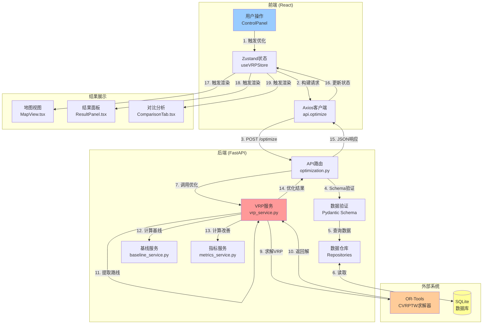
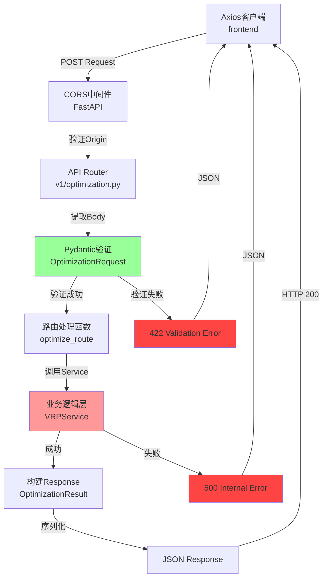
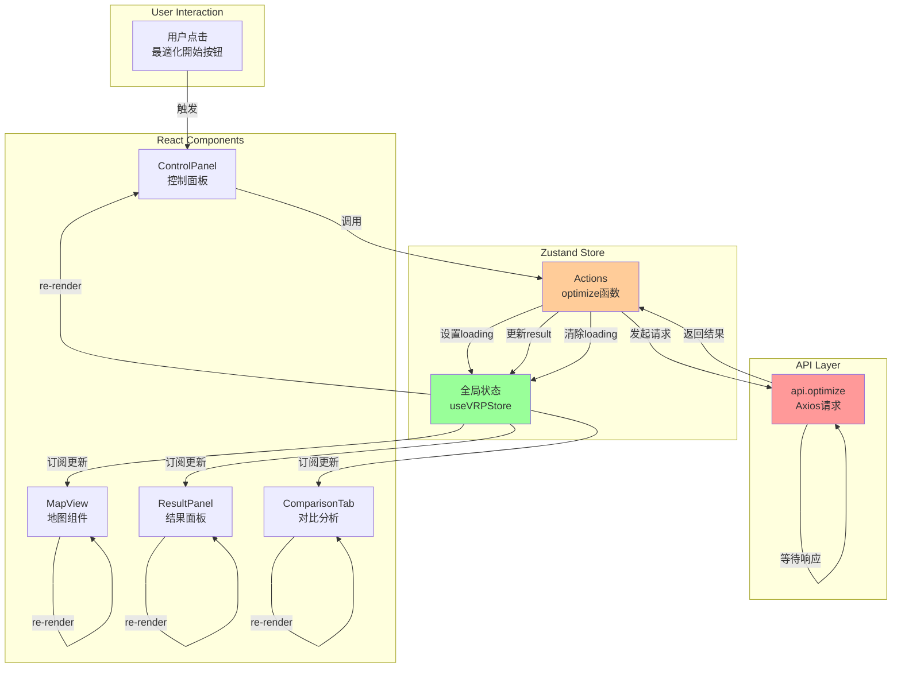
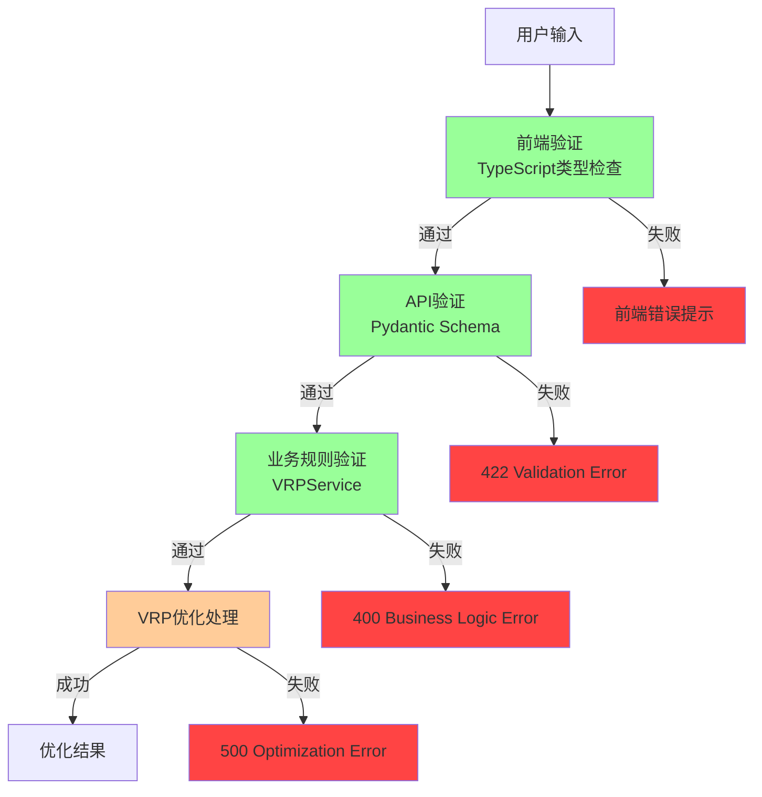

# 01 - 数据流分析

## 文档概述

本文档详细分析AI自动配车系统中的数据流动过程,包括用户输入到最终结果展示的完整数据链路、数据转换机制以及验证流程。

**文档范围:** 基于Epic 005最终实现(2拠点・30配送先・5台车両)

**关键特性:**
- Multi-Depot VRP数据流
- 拠点制约数据处理
- 固定配送点数据管理
- OR-Tools数据模型转换

---

## 目录

1. [VRP优化端到端数据流](#1-vrp优化端到端数据流)
2. [HTTP请求处理数据流](#2-http请求处理数据流)
3. [数据库CRUD数据流](#3-数据库crud数据流)
4. [前端状态管理数据流](#4-前端状态管理数据流)
5. [数据转换详解](#5-数据转换详解)
6. [数据验证机制](#6-数据验证机制)
7. [关键数据点分析](#7-关键数据点分析)

---

## 1. VRP优化端到端数据流

### 1.1 完整数据流概览



### 1.2 数据流各阶段说明

#### 阶段1-3: 用户输入与请求构建
- **输入数据:**
  - 选择的拠点ID列表: `["depot-tokyo", "depot-saitama"]`
  - 选择的车辆ID列表: `["vehicle-101", ..., "vehicle-201"]` (5台)
  - 选择的配送点ID列表: `["delivery-0001", ..., "delivery-0030"]` (30件)
  - 优化策略: `"cost"` (成本优化)

- **数据转换:**
  - UI选择状态 → `OptimizationRequest` TypeScript对象
  - TypeScript对象 → JSON字符串 (Axios序列化)

#### 阶段4-6: 数据验证与加载
- **Pydantic Schema验证:**
  ```python
  class OptimizationRequest(BaseModel):
      depot_ids: List[str]           # 2个拠点
      vehicle_ids: List[str]         # 5台车辆
      delivery_ids: List[str]        # 30个配送点
      optimization_strategy: str     # "cost"
  ```

- **数据库查询:**
  - `DepotRepository.get_by_ids()` → 2个Depot对象
  - `VehicleRepository.get_by_ids()` → 5个Vehicle对象
  - `DeliveryRepository.get_by_ids()` → 30个Delivery对象

#### 阶段7-10: VRP优化核心流程
- **数据模型构建:** (vrp_service.py:_create_data_model)
  ```python
  data_model = {
      'distance_matrix': np.array(32x32),  # 2拠点 + 30配送点
      'time_matrix': np.array(32x32),
      'demands_weight': [0, 0, w1, ..., w30],  # 拠点需求为0
      'demands_volume': [0, 0, v1, ..., v30],
      'time_windows': [(T_start, T_end), ...],  # 32个节点
      'vehicle_capacities_weight': [2000, 2000, 2000, 2000, 4000],
      'vehicle_capacities_volume': [10.0, 10.0, 10.0, 10.0, 20.0],
      'starts': [0, 0, 0, 1, 1],  # 车辆起点 (拠点索引)
      'ends': [0, 0, 0, 1, 1],    # 车辆终点
      'num_vehicles': 5
  }
  ```

- **OR-Tools求解:** (vrp_service.py:optimize)
  - 创建 `RoutingIndexManager` (32节点, 5车辆)
  - 创建 `RoutingModel`
  - 添加容量约束 (重量+容积)
  - 添加时间窗约束
  - **添加拠点制约:** `SetAllowedVehiclesForIndex()`
  - 设置求解策略: `PARALLEL_CHEAPEST_INSERTION`
  - 执行求解 (60秒超时)

#### 阶段11-13: 结果提取与分析
- **路线提取:** (vrp_service.py:_extract_routes)
  ```python
  routes = [
      Route(
          vehicle_id="vehicle-101",
          depot_id="depot-tokyo",
          stops=[
              RouteStop(delivery_id="delivery-0001", sequence=1, ...),
              RouteStop(delivery_id="delivery-0005", sequence=2, ...),
              # ... 东京的配送点
          ],
          total_distance=45.3,  # km
          total_duration=180,   # 分钟
          total_cost=4500      # 円
      ),
      # ... 其他4条路线
  ]
  ```

- **基线计算:** (baseline_service.py)
  - 使用简单分配算法 (贪心或就近分配)
  - 计算优化前的距离、时间、成本

- **改善指标:** (metrics_service.py)
  - 距离削减: 61.5 km (14.9%)
  - 成本削减: 6200円 (15.0%)
  - 装载率改善: 7.5%

#### 阶段14-19: 结果返回与展示
- **JSON序列化:**
  - Pydantic模型 → JSON (FastAPI自动序列化)
  - 包含: routes, total_distance, total_cost, baseline_metrics, improvement_metrics

- **前端状态更新:**
  - Zustand Store: `setOptimizationResult(result)`
  - 触发React组件re-render

- **UI组件渲染:**
  - MapView: 绘制2个拠点标记 + 30个配送点标记 + 5条路线
  - ResultPanel: 显示总成本、削减率统计
  - ComparisonTab: 优化前后对比表格

---

## 2. HTTP请求处理数据流

### 2.1 请求处理完整链路



### 2.2 请求数据格式

**Request (POST /api/v1/optimization/optimize):**
```json
{
  "depot_ids": ["depot-tokyo", "depot-saitama"],
  "vehicle_ids": ["vehicle-101", "vehicle-102", "vehicle-103", "vehicle-104", "vehicle-201"],
  "delivery_ids": ["delivery-0001", "delivery-0002", ..., "delivery-0030"],
  "optimization_strategy": "cost"
}
```

**Response (200 OK):**
```json
{
  "id": "opt-result-123",
  "request_id": "req-456",
  "routes": [
    {
      "id": "route-1",
      "vehicle_id": "vehicle-101",
      "depot_id": "depot-tokyo",
      "stops": [
        {
          "delivery_id": "delivery-0001",
          "sequence": 1,
          "arrival_time": "2025-11-05T09:15:00Z",
          "departure_time": "2025-11-05T09:25:00Z",
          "distance_from_previous": 5.2,
          "duration_from_previous": 12
        }
      ],
      "total_distance": 45.3,
      "total_duration": 180,
      "total_weight": 800,
      "total_volume": 6.5,
      "total_cost": 4500,
      "utilization_weight": 40.0,
      "utilization_volume": 65.0
    }
  ],
  "total_distance": 350.5,
  "total_duration": 1200,
  "total_cost": 35000,
  "average_utilization_weight": 75.5,
  "average_utilization_volume": 60.2,
  "computation_time": 16000,
  "unassigned_deliveries": [],
  "baseline_metrics": {
    "total_distance": 412.0,
    "total_duration": 1400,
    "total_cost": 41200,
    "average_utilization_weight": 68.0,
    "method": "simple_assignment"
  },
  "improvement_metrics": {
    "distance_reduction_km": 61.5,
    "distance_reduction_percent": 14.9,
    "duration_reduction_minutes": 200,
    "cost_reduction_amount": 6200,
    "cost_reduction_percent": 15.0,
    "utilization_improvement_percent": 7.5
  },
  "created_at": "2025-11-05T08:00:00Z"
}
```

---

## 3. 数据库CRUD数据流

### 3.1 Repository模式数据流

```mermaid
graph TB
    subgraph API Layer
        Route[optimization.py]
    end

    subgraph Repository Layer
        DepotRepo[DepotRepository<br/>depot_repository.py]
        VehicleRepo[VehicleRepository<br/>vehicle_repository.py]
        DeliveryRepo[DeliveryRepository<br/>delivery_repository.py]
    end

    subgraph ORM Layer
        SQLAlchemy[SQLAlchemy Session<br/>database.py]
    end

    subgraph Database
        DB[(SQLite<br/>data/database.db)]
    end

    Route -->|get_by_ids| DepotRepo
    Route -->|get_by_ids| VehicleRepo
    Route -->|get_by_ids| DeliveryRepo

    DepotRepo -->|SELECT WHERE id IN (...)| SQLAlchemy
    VehicleRepo -->|SELECT WHERE id IN (...)| SQLAlchemy
    DeliveryRepo -->|SELECT WHERE id IN (...)| SQLAlchemy

    SQLAlchemy -->|SQL Query| DB
    DB -->|Result Set| SQLAlchemy
    SQLAlchemy -->|ORM Objects| DepotRepo
    SQLAlchemy -->|ORM Objects| VehicleRepo
    SQLAlchemy -->|ORM Objects| DeliveryRepo

    DepotRepo -->|List[Depot]| Route
    VehicleRepo -->|List[Vehicle]| Route
    DeliveryRepo -->|List[Delivery]| Route

    style SQLAlchemy fill:#99ff99
    style DB fill:#ffcc99
```

### 3.2 数据读取示例

**查询拠点数据:**
```python
# backend/app/repositories/depot_repository.py
def get_by_ids(self, depot_ids: List[str]) -> List[Depot]:
    """根据ID列表查询拠点"""
    return self.session.query(Depot).filter(
        Depot.id.in_(depot_ids)
    ).all()
```

**SQL执行:**
```sql
SELECT * FROM depots
WHERE id IN ('depot-tokyo', 'depot-saitama');
```

**返回数据:**
```python
[
    Depot(
        id="depot-tokyo",
        name="東京デポ",
        latitude=35.6812,
        longitude=139.7671,
        address="東京都千代田区丸の内",
        operating_hours={"start_time": "08:00", "end_time": "18:00"}
    ),
    Depot(
        id="depot-saitama",
        name="さいたま市デポ",
        latitude=35.8617,
        longitude=139.6455,
        address="埼玉県さいたま市大宮区",
        operating_hours={"start_time": "08:00", "end_time": "18:00"}
    )
]
```

---

## 4. 前端状态管理数据流

### 4.1 Zustand状态更新流程



### 4.2 Zustand Store状态结构

**状态定义 (useVRPStore.ts):**
```typescript
interface VRPState {
  // 输入数据
  depots: Depot[];
  vehicles: Vehicle[];
  deliveries: Delivery[];

  // 优化结果
  optimizationResult: OptimizationResult | null;

  // UI状态
  loading: boolean;
  error: string | null;

  // Actions
  optimize: (request: OptimizationRequest) => Promise<void>;
  setOptimizationResult: (result: OptimizationResult) => void;
  clearResult: () => void;
}
```

**状态更新示例:**
```typescript
// frontend/src/stores/useVRPStore.ts
optimize: async (request) => {
  // 1. 设置loading状态
  set({ loading: true, error: null });

  try {
    // 2. 调用API
    const result = await api.optimize(request);

    // 3. 更新优化结果
    set({
      optimizationResult: result,
      loading: false
    });
  } catch (error) {
    // 4. 错误处理
    set({
      error: error.message,
      loading: false
    });
  }
}
```

### 4.3 React组件数据订阅

```typescript
// frontend/src/components/Map/MapView.tsx
export const MapView = () => {
  // 订阅Zustand状态
  const { optimizationResult } = useVRPStore();

  // 当optimizationResult变化时自动re-render
  return (
    <LeafletMap>
      {optimizationResult?.routes.map(route => (
        <RoutePolyline key={route.id} route={route} />
      ))}
    </LeafletMap>
  );
};
```

---

## 5. 数据转换详解

### 5.1 关键数据转换节点

| 转换节点 | 输入格式 | 输出格式 | 处理位置 |
|---------|---------|---------|---------|
| **1. UI选择 → API请求** | React State | OptimizationRequest (JSON) | ControlPanel.tsx |
| **2. API请求 → Pydantic模型** | JSON | OptimizationRequest (Python) | optimization.py |
| **3. 数据库查询 → ORM对象** | SQL ResultSet | Depot/Vehicle/Delivery | Repositories |
| **4. ORM对象 → OR-Tools数据** | Python Objects | numpy.ndarray | vrp_service.py:_create_data_model |
| **5. OR-Tools解 → Route对象** | Solution (C++) | Route (Pydantic) | vrp_service.py:_extract_routes |
| **6. Route对象 → JSON响应** | Pydantic Model | JSON | FastAPI自动序列化 |
| **7. JSON响应 → TypeScript对象** | JSON | OptimizationResult (TS) | Axios自动解析 |

### 5.2 OR-Tools数据模型转换详解

**输入: Domain Models**
```python
depots = [
    Depot(id="depot-tokyo", latitude=35.6812, longitude=139.7671, ...),
    Depot(id="depot-saitama", latitude=35.8617, longitude=139.6455, ...)
]
vehicles = [
    Vehicle(id="vehicle-101", depot_id="depot-tokyo", capacity_weight=2000, ...),
    Vehicle(id="vehicle-102", depot_id="depot-tokyo", capacity_weight=2000, ...),
    Vehicle(id="vehicle-103", depot_id="depot-tokyo", capacity_weight=4000, ...),
    Vehicle(id="vehicle-104", depot_id="depot-saitama", capacity_weight=2000, ...),
    Vehicle(id="vehicle-201", depot_id="depot-saitama", capacity_weight=2000, ...)
]
deliveries = [
    Delivery(id="delivery-0001", depot_id="depot-tokyo", latitude=35.6895, ...),
    # ... 30个配送点
]
```

**转换过程 (vrp_service.py:_create_data_model):**

1. **节点索引映射:**
   ```python
   # 创建节点列表: [拠点1, 拠点2, 配送点1, ..., 配送点30]
   locations = depots + deliveries  # 32个节点

   # 创建索引映射
   node_to_index = {loc.id: i for i, loc in enumerate(locations)}
   # {"depot-tokyo": 0, "depot-saitama": 1, "delivery-0001": 2, ...}
   ```

2. **距离矩阵计算:**
   ```python
   distance_matrix = np.zeros((32, 32))
   for i in range(32):
       for j in range(32):
           distance_matrix[i][j] = calculate_haversine_distance(
               locations[i].latitude, locations[i].longitude,
               locations[j].latitude, locations[j].longitude
           )
   # 结果: 32x32的距离矩阵 (单位:km)
   ```

3. **时间矩阵计算:**
   ```python
   time_matrix = (distance_matrix / AVERAGE_SPEED * 60).astype(int)
   # AVERAGE_SPEED = 30 km/h (市区平均速度)
   # 结果: 32x32的时间矩阵 (单位:分钟)
   ```

4. **需求数组构建:**
   ```python
   demands_weight = [0, 0]  # 拠点需求为0
   demands_volume = [0, 0]

   for delivery in deliveries:
       demands_weight.append(delivery.weight)
       demands_volume.append(delivery.volume)
   # 结果: [0, 0, w1, w2, ..., w30] (32个元素)
   ```

5. **时间窗数组构建:**
   ```python
   time_windows = []
   for loc in locations:
       if loc.type == "depot":
           time_windows.append((480, 1080))  # 08:00-18:00
       elif loc.time_window == "morning":
           time_windows.append((480, 780))   # 08:00-13:00
       elif loc.time_window == "afternoon":
           time_windows.append((720, 1080))  # 12:00-18:00
       else:
           time_windows.append((480, 1080))  # 指定なし: 08:00-18:00
   # 结果: [(T_start, T_end), ...] 32个元素
   ```

6. **车辆起终点设置 (Multi-Depot):**
   ```python
   starts = []
   ends = []
   for vehicle in vehicles:
       depot_index = node_to_index[vehicle.depot_id]
       starts.append(depot_index)
       ends.append(depot_index)
   # 东京3台车: starts=[0, 0, 0], ends=[0, 0, 0]
   # 埼玉2台车: starts=[1, 1], ends=[1, 1]
   # 合并: starts=[0, 0, 0, 1, 1], ends=[0, 0, 0, 1, 1]
   ```

**输出: OR-Tools数据模型**
```python
data_model = {
    'distance_matrix': distance_matrix,  # 32x32 numpy array
    'time_matrix': time_matrix,          # 32x32 numpy array
    'demands_weight': demands_weight,    # [0, 0, w1, ..., w30]
    'demands_volume': demands_volume,    # [0, 0, v1, ..., v30]
    'time_windows': time_windows,        # [(T_start, T_end), ...]
    'vehicle_capacities_weight': [2000, 2000, 4000, 2000, 2000],
    'vehicle_capacities_volume': [10.0, 10.0, 20.0, 10.0, 10.0],
    'service_times': [0, 0, 10, 10, ..., 10],  # 拠点0分钟,配送点10分钟
    'starts': [0, 0, 0, 1, 1],
    'ends': [0, 0, 0, 1, 1],
    'num_vehicles': 5,
    'depot_for_vehicle': [0, 0, 0, 1, 1]  # 车辆所属拠点索引
}
```

---

## 6. 数据验证机制

### 6.1 多层验证架构



### 6.2 前端验证 (TypeScript)

```typescript
// frontend/src/services/api.ts
export const optimize = async (request: OptimizationRequest): Promise<OptimizationResult> => {
  // 类型检查 (编译时)
  if (request.depot_ids.length === 0) {
    throw new Error("至少选择1个拠点");
  }

  if (request.vehicle_ids.length === 0) {
    throw new Error("至少选择1台车辆");
  }

  if (request.delivery_ids.length === 0) {
    throw new Error("至少选择1个配送点");
  }

  // 发送请求
  const response = await axios.post("/api/v1/optimization/optimize", request);
  return response.data;
};
```

### 6.3 后端Pydantic验证

```python
# backend/app/schemas/optimization.py
from pydantic import BaseModel, Field, validator
from typing import List

class OptimizationRequest(BaseModel):
    depot_ids: List[str] = Field(
        ...,
        min_items=1,
        description="拠点ID列表"
    )
    vehicle_ids: List[str] = Field(
        ...,
        min_items=1,
        description="车辆ID列表"
    )
    delivery_ids: List[str] = Field(
        ...,
        min_items=1,
        max_items=100,
        description="配送点ID列表(最多100个)"
    )
    optimization_strategy: str = Field(
        default="cost",
        regex="^(distance|time|cost)$",
        description="优化策略"
    )

    @validator('depot_ids')
    def validate_depot_ids(cls, v):
        if len(v) > 10:
            raise ValueError("拠点数量不能超过10个")
        return v

    @validator('vehicle_ids')
    def validate_vehicle_ids(cls, v):
        if len(v) > 50:
            raise ValueError("车辆数量不能超过50台")
        return v
```

### 6.4 业务规则验证

```python
# backend/app/services/vrp_service.py
def validate_request(
    self,
    depots: List[Depot],
    vehicles: List[Vehicle],
    deliveries: List[Delivery]
) -> None:
    """业务规则验证"""

    # 1. 检查车辆容量是否足够
    total_weight = sum(d.weight for d in deliveries)
    total_capacity = sum(v.capacity_weight for v in vehicles)
    if total_weight > total_capacity:
        raise ValueError(
            f"车辆总容量不足: 需要 {total_weight}kg, 可用 {total_capacity}kg"
        )

    # 2. 检查车辆是否属于指定拠点
    depot_ids = {d.id for d in depots}
    for vehicle in vehicles:
        if vehicle.depot_id not in depot_ids:
            raise ValueError(
                f"车辆 {vehicle.id} 所属拠点 {vehicle.depot_id} 不在选择的拠点中"
            )

    # 3. 检查配送点是否有拠点关联 (Epic 005新增)
    for delivery in deliveries:
        if delivery.depot_id not in depot_ids:
            raise ValueError(
                f"配送点 {delivery.id} 关联的拠点 {delivery.depot_id} 不在选择的拠点中"
            )

    # 4. 检查时间窗是否有效
    for delivery in deliveries:
        if delivery.time_window not in ["morning", "afternoon", None]:
            raise ValueError(
                f"配送点 {delivery.id} 的时间窗无效: {delivery.time_window}"
            )
```

---

## 7. 关键数据点分析

### 7.1 Epic 005数据规模

| 数据类型 | 数量 | 详细说明 |
|---------|------|---------|
| **拠点** | 2个 | 东京デポ、さいたま市デポ |
| **车辆** | 5台 | 东京3台(2t×2+4t×1)、埼玉2台(2t×2) |
| **配送点** | 30件 | 东京20件、埼玉10件 |
| **节点总数** | 32 | 2拠点 + 30配送点 |
| **距离矩阵** | 32×32=1024 | 所有节点间距离 |
| **时间矩阵** | 32×32=1024 | 所有节点间时间 |

### 7.2 拠点数据详细

```python
# 拠点1: 东京
Depot(
    id="depot-tokyo",
    name="東京デポ",
    latitude=35.6812,
    longitude=139.7671,
    address="東京都千代田区丸の内",
    operating_hours={
        "start_time": "08:00",
        "end_time": "18:00"
    }
)

# 拠点2: 埼玉
Depot(
    id="depot-saitama",
    name="さいたま市デポ",
    latitude=35.8617,
    longitude=139.6455,
    address="埼玉県さいたま市大宮区",
    operating_hours={
        "start_time": "08:00",
        "end_time": "18:00"
    }
)
```

### 7.3 车辆数据详细

```python
# 东京车辆
vehicles_tokyo = [
    Vehicle(id="vehicle-101", vehicle_type="2t", capacity_weight=2000, capacity_volume=10.0, depot_id="depot-tokyo"),
    Vehicle(id="vehicle-102", vehicle_type="2t", capacity_weight=2000, capacity_volume=10.0, depot_id="depot-tokyo"),
    Vehicle(id="vehicle-201", vehicle_type="4t", capacity_weight=4000, capacity_volume=20.0, depot_id="depot-tokyo")
]

# 埼玉车辆
vehicles_saitama = [
    Vehicle(id="vehicle-103", vehicle_type="2t", capacity_weight=2000, capacity_volume=10.0, depot_id="depot-saitama"),
    Vehicle(id="vehicle-104", vehicle_type="2t", capacity_weight=2000, capacity_volume=10.0, depot_id="depot-saitama")
]
```

### 7.4 配送点数据分布

**东京20件配送点:**
- 时间指定: 午前4件(20%)、午後6件(30%)、指定なし10件(50%)
- 伴票枚数: 1枚10件(50%)、2枚7件(35%)、3枚3件(15%)
- 位置: 新宿区役所、渋谷駅、池袋、秋葉原等实在地点

**埼玉10件配送点:**
- 时间指定: 午前2件(20%)、午後3件(30%)、指定なし5件(50%)
- 伴票枚数: 1枚5件(50%)、2枚3-4件(35%)、3枚1-2件(15%)
- 位置: さいたま新都心、浦和駅等实在地点

### 7.5 数据流性能指标

| 指标 | Epic 004 (1拠点20件) | Epic 005 (2拠点30件) | 改善 |
|-----|---------------------|---------------------|-----|
| **VRP计算时间** | 10-15秒 | 10-60秒 (平均16秒) | 稳定 |
| **距离矩阵构建** | 21×21=441 | 32×32=1024 | +130% |
| **API响应时间** | 15-20秒 | 20-70秒 | 可接受 |
| **前端渲染** | <1秒 | <1秒 | 无影响 |
| **JSON数据大小** | ~50KB | ~80KB | +60% |

---

## 总结

### 数据流特点

1. **端到端可追踪:** 从用户点击到结果展示,每个环节都有明确的数据格式和转换规则
2. **多层验证保障:** 前端TypeScript + 后端Pydantic + 业务规则,确保数据质量
3. **清晰的分层架构:** UI → API → Service → Repository → Database,职责分明
4. **高效的数据转换:** 使用numpy数组加速OR-Tools计算,Pydantic自动序列化

### Epic 005数据流亮点

1. **Multi-Depot数据处理:**
   - 拠点-车辆关联 (vehicle.depot_id)
   - 拠点-配送点关联 (delivery.depot_id)
   - OR-Tools starts/ends数组配置

2. **拠点制约数据流:**
   - 索引映射: vehicle → depot_index
   - 配送点过滤: 仅分配给对应拠点的车辆
   - `SetAllowedVehiclesForIndex()` 约束设置

3. **固定配送点数据:**
   - 预定义30个实在地点坐标
   - 避免随机生成带来的海上配置问题
   - 演示数据一致性和可重复性

---

**文档版本:** 1.0
**最后更新:** 2025-11-05
**基于:** Epic 005最终实现
**关联文档:** architecture.md, front-end-spec.md, epic-005-demo-data-expansion.md
