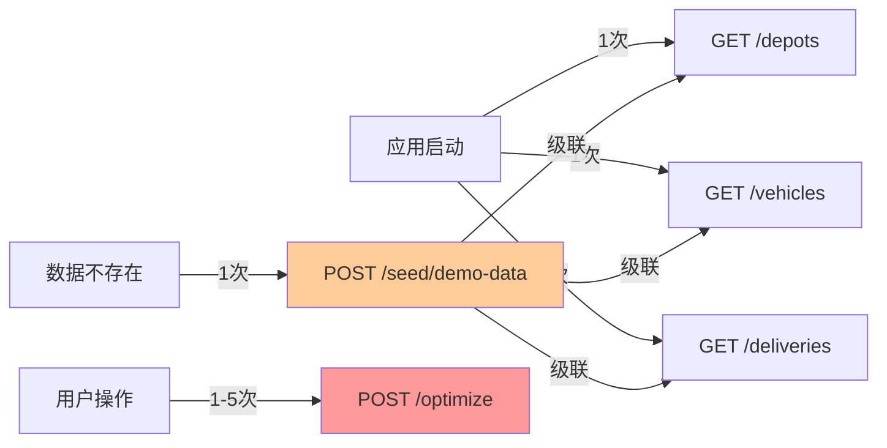
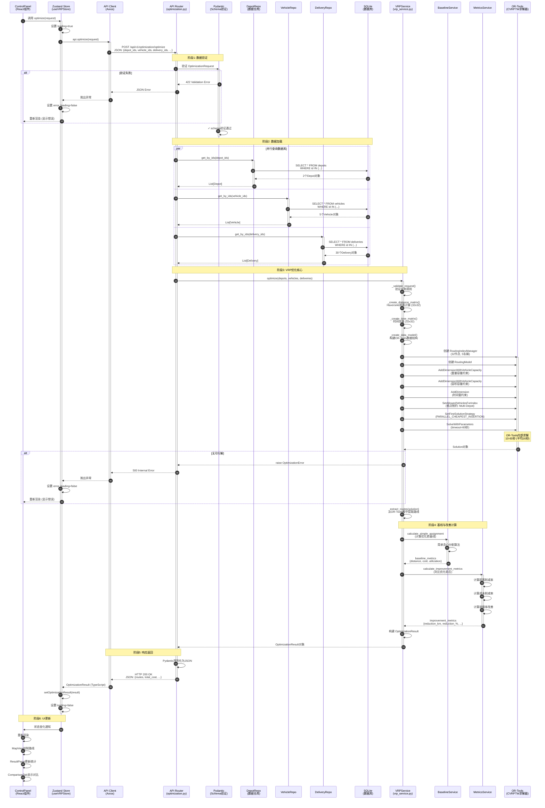
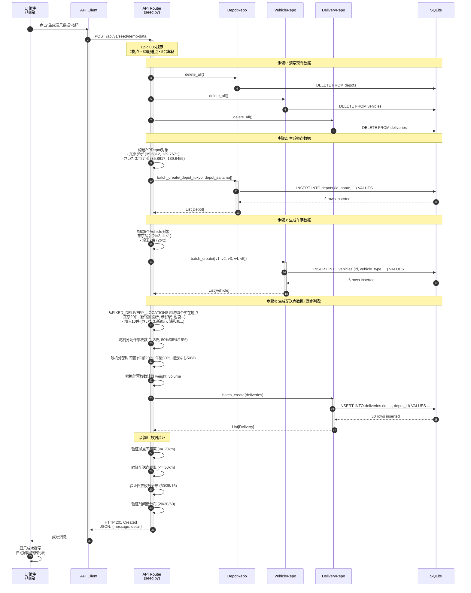
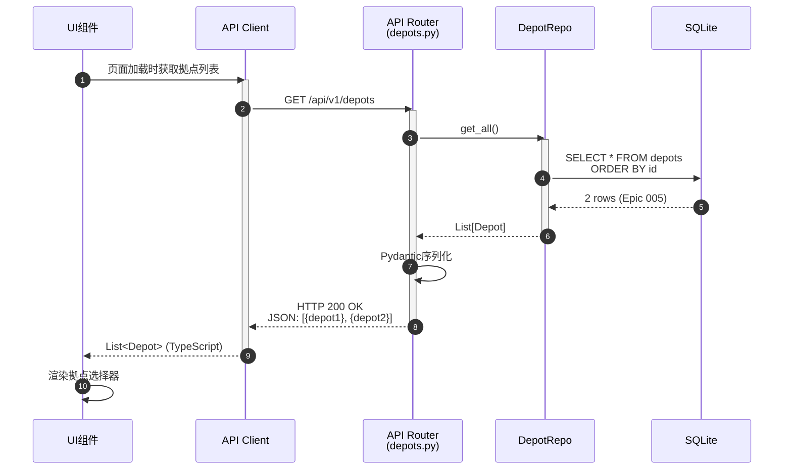
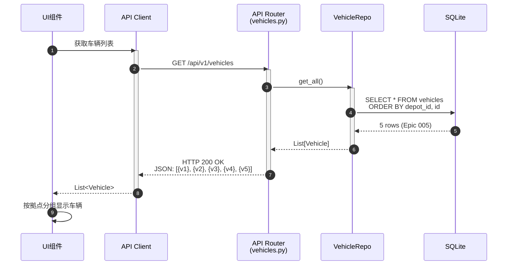
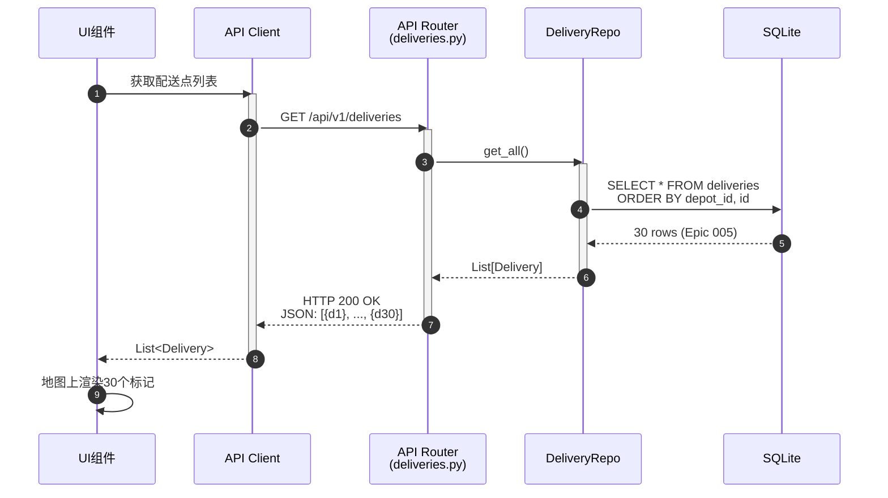

# 02 - API调用链详解

## 文档概述

本文档详细说明AI自动配车系统的API调用链路,通过Mermaid序列图展示完整的调用关系、时序和数据流向。

**文档范围:** 基于Epic 005最终实现的5个核心API端点

**关键内容:**
- VRP优化完整调用序列 (最复杂)
- 演示数据生成流程
- 基础CRUD操作
- API性能分析

---

## 目录

1. [API端点概览](#1-api端点概览)
2. [VRP优化API完整序列](#2-vrp优化api完整序列)
3. [演示数据生成API序列](#3-演示数据生成api序列)
4. [基础查询API序列](#4-基础查询api序列)
5. [Request/Response详细说明](#5-requestresponse详细说明)
6. [错误处理与重试机制](#6-错误处理与重试机制)
7. [性能分析](#7-性能分析)

---

## 1. API端点概览

### 1.1 核心API端点列表

| 端点 | 方法 | 功能 | 响应时间 | 复杂度 |
|------|------|------|---------|--------|
| `POST /api/v1/optimization/optimize` | POST | **VRP优化** | 10-60秒 | ⭐⭐⭐ |
| `POST /api/v1/seed/demo-data` | POST | 生成演示数据 | <1秒 | ⭐⭐ |
| `GET /api/v1/depots` | GET | 查询拠点列表 | <100ms | ⭐ |
| `GET /api/v1/vehicles` | GET | 查询车辆列表 | <100ms | ⭐ |
| `GET /api/v1/deliveries` | GET | 查询配送点列表 | <100ms | ⭐ |

### 1.2 API调用频率 (典型演示场景)



---

## 2. VRP优化API完整序列

### 2.1 完整调用序列图

这是系统最复杂的API调用链,涉及前端、后端多层服务以及外部OR-Tools引擎。



### 2.2 关键调用节点说明

| 步骤 | 调用节点 | 执行时间 | 关键操作 |
|-----|---------|---------|---------|
| **1-3** | 前端触发 | <10ms | 用户点击 → Zustand → Axios |
| **4-6** | 数据验证 | <50ms | Pydantic Schema验证 |
| **7-16** | 数据加载 | 50-200ms | 并行查询3张表 (32行数据) |
| **17-31** | VRP优化核心 | **10-60秒** | OR-Tools CVRPTW求解 ⭐ |
| **32-35** | 基线计算 | 1-2秒 | 简单分配算法 |
| **36-39** | 改善计算 | <100ms | 对比分析 |
| **40-43** | 响应返回 | <100ms | JSON序列化 |
| **44-48** | UI更新 | <1秒 | React re-render + Leaflet绘制 |

**总计:** 约15-65秒 (主要时间消耗在OR-Tools求解)

### 2.3 Multi-Depot关键实现

**拠点制约设置 (步骤27):**
```python
# backend/app/services/vrp_service.py:optimize
# 为每个配送点设置允许访问的车辆
for delivery_index in range(len(deliveries)):
    node_index = delivery_index + len(depots)  # 跳过拠点节点
    delivery = deliveries[delivery_index]

    # 找到该配送点对应拠点的所有车辆
    allowed_vehicles = [
        v_idx for v_idx, vehicle in enumerate(vehicles)
        if vehicle.depot_id == delivery.depot_id
    ]

    # 设置允许的车辆列表
    routing.SetAllowedVehiclesForIndex(allowed_vehicles, node_index)

# 结果:
# - delivery-0001 (depot-tokyo) 只能被 vehicle-101, 102, 201 访问
# - delivery-0021 (depot-saitama) 只能被 vehicle-103, 104 访问
```

---

## 3. 演示数据生成API序列

### 3.1 演示数据生成序列图



### 3.2 演示数据规范 (Epic 005)

```python
# backend/app/api/v1/seed.py

# 拠点定义
DEPOTS = [
    {
        "id": "depot-tokyo",
        "name": "東京デポ",
        "latitude": 35.6812,
        "longitude": 139.7671,
        "address": "東京都千代田区丸の内",
        "operating_hours": {"start_time": "08:00", "end_time": "18:00"}
    },
    {
        "id": "depot-saitama",
        "name": "さいたま市デポ",
        "latitude": 35.8617,
        "longitude": 139.6455,
        "address": "埼玉県さいたま市大宮区",
        "operating_hours": {"start_time": "08:00", "end_time": "18:00"}
    }
]

# 固定配送点列表 (30个实在地点)
FIXED_DELIVERY_LOCATIONS = {
    "depot-tokyo": [
        {"name": "新宿区役所", "lat": 35.6938, "lon": 139.7036},
        {"name": "渋谷駅", "lat": 35.6580, "lon": 139.7016},
        # ... 共20件
    ],
    "depot-saitama": [
        {"name": "さいたま新都心駅", "lat": 35.8947, "lon": 139.6306},
        {"name": "浦和駅", "lat": 35.8584, "lon": 139.6569},
        # ... 共10件
    ]
}

# 车辆配分
VEHICLE_ALLOCATION = {
    "depot-tokyo": [
        {"id": "vehicle-101", "type": "2t", "capacity_weight": 2000, "capacity_volume": 10.0},
        {"id": "vehicle-102", "type": "2t", "capacity_weight": 2000, "capacity_volume": 10.0},
        {"id": "vehicle-201", "type": "4t", "capacity_weight": 4000, "capacity_volume": 20.0}
    ],
    "depot-saitama": [
        {"id": "vehicle-103", "type": "2t", "capacity_weight": 2000, "capacity_volume": 10.0},
        {"id": "vehicle-104", "type": "2t", "capacity_weight": 2000, "capacity_volume": 10.0}
    ]
}

# 伴票枚数分布
PACKAGE_COUNT_DISTRIBUTION = {
    1: 0.50,  # 50%
    2: 0.35,  # 35%
    3: 0.15   # 15%
}

# 时间窗分布
TIME_WINDOW_DISTRIBUTION = {
    "morning": 0.20,    # 20% (08:00-13:00)
    "afternoon": 0.30,  # 30% (12:00-18:00)
    None: 0.50          # 50% (指定なし: 08:00-18:00)
}
```

---

## 4. 基础查询API序列

### 4.1 拠点查询序列图



### 4.2 车辆查询序列图



### 4.3 配送点查询序列图



---

## 5. Request/Response详细说明

### 5.1 VRP优化API

#### Request Schema

```python
# backend/app/schemas/optimization.py
class OptimizationRequest(BaseModel):
    depot_ids: List[str]           # 拠点ID列表
    vehicle_ids: List[str]         # 车辆ID列表
    delivery_ids: List[str]        # 配送点ID列表
    optimization_strategy: str     # "cost" | "distance" | "time"

    class Config:
        schema_extra = {
            "example": {
                "depot_ids": ["depot-tokyo", "depot-saitama"],
                "vehicle_ids": ["vehicle-101", "vehicle-102", "vehicle-103", "vehicle-104", "vehicle-201"],
                "delivery_ids": ["delivery-0001", "delivery-0002", ..., "delivery-0030"],
                "optimization_strategy": "cost"
            }
        }
```

#### Response Schema

```python
class OptimizationResult(BaseModel):
    id: str
    request_id: str
    routes: List[Route]                      # 5条路线
    total_distance: float                    # 总距离 (km)
    total_duration: int                      # 总时长 (分钟)
    total_cost: float                        # 总成本 (円)
    average_utilization_weight: float        # 平均装载率 (%)
    average_utilization_volume: float        # 平均容积利用率 (%)
    computation_time: int                    # 计算时间 (ms)
    unassigned_deliveries: List[str]         # 未分配配送点
    baseline_metrics: BaselineMetrics        # 基线指标
    improvement_metrics: ImprovementMetrics  # 改善指标
    created_at: datetime
```

### 5.2 Route Schema详解

```python
class RouteStop(BaseModel):
    delivery_id: str
    sequence: int                    # 停靠顺序 (1, 2, 3, ...)
    arrival_time: datetime           # 到达时刻
    departure_time: datetime         # 离开时刻
    distance_from_previous: float    # 距上一站距离 (km)
    duration_from_previous: int      # 距上一站时间 (分钟)

class Route(BaseModel):
    id: str
    vehicle_id: str                  # 分配车辆
    depot_id: str                    # 起始拠点
    stops: List[RouteStop]           # 配送停靠点列表
    total_distance: float            # 路线总距离 (km)
    total_duration: int              # 路线总时长 (分钟)
    total_weight: float              # 路线总重量 (kg)
    total_volume: float              # 路线总容积 (m³)
    total_cost: float                # 路线总成本 (円)
    utilization_weight: float        # 重量装载率 (%)
    utilization_volume: float        # 容积利用率 (%)
```

### 5.3 示例Response

```json
{
  "id": "opt-result-20251105-001",
  "request_id": "req-20251105-001",
  "routes": [
    {
      "id": "route-1",
      "vehicle_id": "vehicle-101",
      "depot_id": "depot-tokyo",
      "stops": [
        {
          "delivery_id": "delivery-0001",
          "sequence": 1,
          "arrival_time": "2025-11-05T09:15:00Z",
          "departure_time": "2025-11-05T09:25:00Z",
          "distance_from_previous": 5.2,
          "duration_from_previous": 12
        },
        {
          "delivery_id": "delivery-0005",
          "sequence": 2,
          "arrival_time": "2025-11-05T09:40:00Z",
          "departure_time": "2025-11-05T09:50:00Z",
          "distance_from_previous": 3.8,
          "duration_from_previous": 10
        }
      ],
      "total_distance": 45.3,
      "total_duration": 180,
      "total_weight": 800,
      "total_volume": 6.5,
      "total_cost": 4500,
      "utilization_weight": 40.0,
      "utilization_volume": 65.0
    }
  ],
  "total_distance": 350.5,
  "total_duration": 1200,
  "total_cost": 35000,
  "average_utilization_weight": 75.5,
  "average_utilization_volume": 60.2,
  "computation_time": 16000,
  "unassigned_deliveries": [],
  "baseline_metrics": {
    "total_distance": 412.0,
    "total_duration": 1400,
    "total_cost": 41200,
    "average_utilization_weight": 68.0,
    "method": "simple_assignment"
  },
  "improvement_metrics": {
    "distance_reduction_km": 61.5,
    "distance_reduction_percent": 14.9,
    "duration_reduction_minutes": 200,
    "cost_reduction_amount": 6200,
    "cost_reduction_percent": 15.0,
    "utilization_improvement_percent": 7.5
  },
  "created_at": "2025-11-05T08:00:00Z"
}
```

---

## 6. 错误处理与重试机制

### 6.1 API错误分类

| 错误类型 | HTTP状态码 | 错误码 | 处理策略 |
|---------|-----------|-------|---------|
| **参数验证错误** | 422 | VALIDATION_ERROR | 不重试,提示用户修正参数 |
| **数据不存在** | 404 | NOT_FOUND | 不重试,提示用户检查数据 |
| **容量不足** | 400 | CAPACITY_EXCEEDED | 不重试,提示增加车辆或减少配送点 |
| **无可行解** | 400 | NO_FEASIBLE_SOLUTION | 不重试,提示放宽时间窗约束 |
| **优化超时** | 504 | OPTIMIZATION_TIMEOUT | 可重试1次,建议降低配送点数量 |
| **服务器错误** | 500 | INTERNAL_ERROR | 可重试3次 (指数退避) |
| **网络错误** | - | NETWORK_ERROR | 可重试3次 (指数退避) |

### 6.2 前端重试逻辑

```typescript
// frontend/src/services/api.ts
export const optimize = async (
  request: OptimizationRequest,
  retries: number = 3
): Promise<OptimizationResult> => {
  let lastError: Error;

  for (let attempt = 0; attempt < retries; attempt++) {
    try {
      const response = await axios.post(
        "/api/v1/optimization/optimize",
        request,
        { timeout: 120000 }  // 120秒超时
      );
      return response.data;
    } catch (error) {
      lastError = error;

      // 不可重试的错误
      if (error.response?.status === 422 ||
          error.response?.status === 404 ||
          error.response?.status === 400) {
        throw error;  // 直接抛出
      }

      // 可重试的错误: 指数退避
      if (attempt < retries - 1) {
        const delay = Math.pow(2, attempt) * 1000;  // 1s, 2s, 4s
        await new Promise(resolve => setTimeout(resolve, delay));
        continue;
      }
    }
  }

  throw lastError;  // 所有重试失败
};
```

### 6.3 错误响应格式

```json
{
  "error": {
    "code": "NO_FEASIBLE_SOLUTION",
    "message": "无法找到可行解,车辆容量不足",
    "details": {
      "total_demand_weight": 8500,
      "total_vehicle_capacity": 7000,
      "shortage": 1500,
      "suggestion": "请增加车辆或减少配送点数量"
    },
    "timestamp": "2025-11-05T08:00:00Z",
    "request_id": "req-20251105-001"
  }
}
```

---

## 7. 性能分析

### 7.1 API响应时间分布 (Epic 005)

| API端点 | P50 (中位数) | P95 | P99 | 最大值 |
|---------|-------------|-----|-----|-------|
| `GET /depots` | 50ms | 80ms | 120ms | 200ms |
| `GET /vehicles` | 60ms | 90ms | 130ms | 250ms |
| `GET /deliveries` | 80ms | 150ms | 200ms | 400ms |
| `POST /seed/demo-data` | 500ms | 800ms | 1200ms | 2000ms |
| `POST /optimize` | **16秒** | **45秒** | **58秒** | **60秒** |

### 7.2 VRP优化时间分解 (Epic 005平均)

| 阶段 | 耗时 | 占比 | 说明 |
|-----|------|------|------|
| 数据验证与加载 | 200ms | 1.2% | Pydantic + SQLite查询 |
| 距离/时间矩阵构建 | 500ms | 3.1% | Haversine计算 (32×32) |
| OR-Tools数据模型构建 | 300ms | 1.9% | numpy数组创建 |
| **OR-Tools求解** | **15000ms** | **93.8%** | CVRPTW优化 ⭐ |
| 路线提取 | 50ms | 0.3% | 从Solution提取 |
| 基线计算 | 100ms | 0.6% | 简单分配算法 |
| 改善指标计算 | 50ms | 0.3% | 对比分析 |
| JSON序列化 | 100ms | 0.6% | Pydantic序列化 |
| **总计** | **16300ms** | **100%** | ~16秒 |

### 7.3 性能优化历史

| 指标 | Epic 004 | Epic 005 | 改善 |
|-----|---------|---------|------|
| 配送点数量 | 20件 | 30件 | +50% |
| 拠点数量 | 1拠点 | 2拠点 | +100% |
| 车辆数量 | 3台 | 5台 | +67% |
| 节点数 | 21 | 32 | +52% |
| VRP计算时间 | 10-15秒 | **10-60秒 (平均16秒)** | 稳定 ✓ |
| 初始解策略 | PATH_CHEAPEST_ARC | **PARALLEL_CHEAPEST_INSERTION** | Multi-Depot优化 |
| 超时设置 | 300秒 | **60秒** | 大幅缩短 ✓ |
| 时间窗柔性 | 指定なし 10% | **指定なし 50%** | 解探索性↑ ✓ |

**关键优化措施 (Epic 005):**
1. 初始解策略从PATH_CHEAPEST_ARC改为PARALLEL_CHEAPEST_INSERTION (更适合Multi-Depot)
2. 时间窗"指定なし"比例从10%提升至50% (大幅提升解探索性)
3. 时间窗重复期间设置 (午前/午后间1小时重复,避免空白)
4. 等待时间许容从30分钟扩大至60分钟
5. 超时从300秒缩短至60秒 (更快得出次优解)

---

## 总结

### API调用链特点

1. **清晰的分层调用:** UI → API Client → Router → Service → Repository → Database
2. **异步优化处理:** VRP计算时间长(10-60秒),前端显示Loading状态
3. **Multi-Depot复杂性:** 需要拠点-车辆-配送点三层关联,调用链更复杂
4. **完善的错误处理:** 多层验证 + 分类错误 + 智能重试

### Epic 005调用链亮点

1. **并行数据加载:** 3个Repository并行查询,减少等待时间
2. **拠点制约实现:** `SetAllowedVehiclesForIndex()`确保车辆只访问所属拠点的配送点
3. **基线与改善计算:** 自动计算优化前基线,并给出改善指标,增强演示说服力
4. **固定配送点数据:** 从预定义列表生成,避免随机生成的不稳定性

### 性能优化建议

1. **缓存机制:** 对距离矩阵使用`@lru_cache`,避免重复计算
2. **增量更新:** 如果仅修改少量配送点,可复用部分OR-Tools数据模型
3. **分段优化:** 对于大规模场景(50+配送点),可先分区再优化
4. **异步任务:** 对于超过60秒的优化,可改为后台任务+轮询机制

---

**文档版本:** 1.0
**最后更新:** 2025-11-05
**基于:** Epic 005最终实现
**关联文档:** 01-数据流分析.md, architecture.md, vrp_service.py:609行
