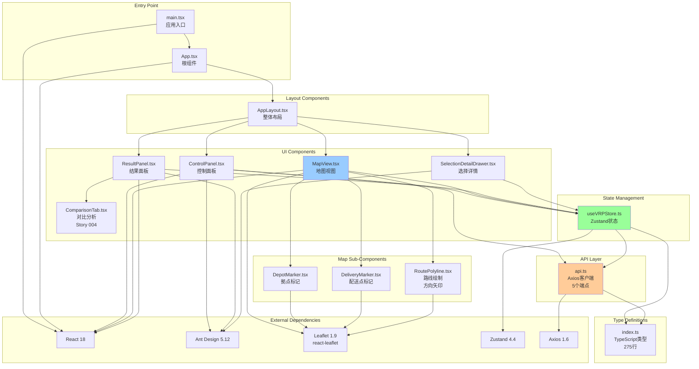
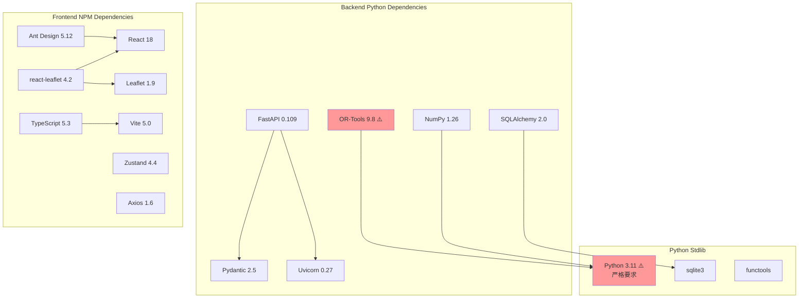

# 03 - 依赖关系分析

## 文档概述

本文档详细分析AI自动配车系统的依赖关系,包括后端模块依赖、前端组件依赖、技术栈依赖管理以及循环依赖检测。

**文档范围:** 完整的前后端依赖树分析

**关键内容:**
- Python后端模块依赖树
- React前端组件依赖树
- 外部技术栈依赖管理
- 依赖版本约束与兼容性

---

## 目录

1. [后端模块依赖树](#1-后端模块依赖树)
2. [前端组件依赖树](#2-前端组件依赖树)
3. [技术栈依赖管理](#3-技术栈依赖管理)
4. [关键依赖详解](#4-关键依赖详解)
5. [循环依赖检测](#5-循环依赖检测)
6. [依赖版本管理策略](#6-依赖版本管理策略)

---

## 1. 后端模块依赖树

### 1.1 完整后端依赖图

```mermaid
graph TB
    subgraph API Layer
        OptAPI[optimization.py<br/>API路由]
        SeedAPI[seed.py<br/>数据生成API]
        DepotAPI[depots.py]
        VehicleAPI[vehicles.py]
        DeliveryAPI[deliveries.py]
    end

    subgraph Service Layer
        VRPSvc[vrp_service.py<br/>VRP优化核心<br/>609行]
        BaseSvc[baseline_service.py<br/>基线计算]
        MetricsSvc[metrics_service.py<br/>改善指标]
    end

    subgraph Repository Layer
        DepotRepo[depot_repository.py]
        VehicleRepo[vehicle_repository.py]
        DeliveryRepo[delivery_repository.py]
        OptRepo[optimization_repository.py]
    end

    subgraph Model Layer
        DepotModel[depot.py<br/>Depot模型]
        VehicleModel[vehicle.py<br/>Vehicle模型]
        DeliveryModel[delivery.py<br/>Delivery模型]
        OptModel[optimization_result.py]
        RouteModel[route.py]
    end

    subgraph Schema Layer
        OptSchema[optimization.py<br/>Pydantic Schema]
        DepotSchema[depot.py<br/>Schema]
        VehicleSchema[vehicle.py<br/>Schema]
        DeliverySchema[delivery.py<br/>Schema]
    end

    subgraph Database Layer
        DB[database.py<br/>SQLAlchemy连接]
        SQLite[(SQLite<br/>data.db)]
    end

    subgraph External Dependencies
        ORTools[OR-Tools<br/>Google优化库]
        NumPy[NumPy<br/>数值计算]
        FastAPI[FastAPI<br/>Web框架]
        Pydantic[Pydantic<br/>数据验证]
        SQLAlchemy[SQLAlchemy<br/>ORM]
    end

    OptAPI --> OptSchema
    OptAPI --> VRPSvc
    OptAPI --> DepotRepo
    OptAPI --> VehicleRepo
    OptAPI --> DeliveryRepo

    SeedAPI --> DepotRepo
    SeedAPI --> VehicleRepo
    SeedAPI --> DeliveryRepo

    DepotAPI --> DepotRepo
    VehicleAPI --> VehicleRepo
    DeliveryAPI --> DeliveryRepo

    VRPSvc --> DepotModel
    VRPSvc --> VehicleModel
    VRPSvc --> DeliveryModel
    VRPSvc --> OptModel
    VRPSvc --> RouteModel
    VRPSvc --> BaseSvc
    VRPSvc --> MetricsSvc
    VRPSvc --> ORTools
    VRPSvc --> NumPy

    BaseSvc --> DepotModel
    BaseSvc --> VehicleModel
    BaseSvc --> DeliveryModel

    MetricsSvc --> OptModel

    DepotRepo --> DepotModel
    DepotRepo --> DB
    VehicleRepo --> VehicleModel
    VehicleRepo --> DB
    DeliveryRepo --> DeliveryModel
    DeliveryRepo --> DB
    OptRepo --> OptModel
    OptRepo --> DB

    DB --> SQLAlchemy
    DB --> SQLite

    OptAPI --> FastAPI
    OptSchema --> Pydantic

    style VRPSvc fill:#ff9999
    style ORTools fill:#ffcc99
    style SQLite fill:#ffff99
```



### 1.2 分层依赖说明

| 层级 | 功能 | 依赖方向 | 关键文件数 |
|-----|------|---------|-----------|
| **API Layer** | HTTP请求处理 | → Service + Repository + Schema | 5个 |
| **Service Layer** | 业务逻辑 | → Repository + Model + External | 3个 |
| **Repository Layer** | 数据访问 | → Model + Database | 4个 |
| **Model Layer** | 数据模型 | → SQLAlchemy | 5个 |
| **Schema Layer** | 数据验证 | → Pydantic | 4个 |
| **Database Layer** | 数据库连接 | → SQLAlchemy + SQLite | 1个 |

**依赖规则:**
- 上层可以依赖下层,禁止下层依赖上层
- 同层模块之间最小化依赖
- Service层可以相互依赖 (VRPService → BaselineService → MetricsService)

### 1.3 核心文件依赖关系

#### vrp_service.py (609行) - 最复杂模块

```python
# backend/app/services/vrp_service.py

# 内部依赖
from app.models.depot import Depot
from app.models.vehicle import Vehicle
from app.models.delivery import Delivery
from app.models.route import Route
from app.models.optimization_result import OptimizationResult
from app.services.baseline_service import BaselineService
from app.services.metrics_service import MetricsService
from app.utils.haversine import calculate_haversine_distance

# 外部依赖
from ortools.constraint_solver import pywrapcp, routing_enums_pb2
import numpy as np
from functools import lru_cache
from typing import List, Dict, Tuple
import logging
```

**依赖层次:**
1. **Data Models** (5个): Depot, Vehicle, Delivery, Route, OptimizationResult
2. **Services** (2个): BaselineService, MetricsService
3. **Utils** (1个): haversine.py
4. **External** (2个): OR-Tools, NumPy

#### optimization.py (API路由)

```python
# backend/app/api/v1/optimization.py

# 内部依赖
from app.schemas.optimization import OptimizationRequest, OptimizationResult
from app.repositories.depot_repository import DepotRepository
from app.repositories.vehicle_repository import VehicleRepository
from app.repositories.delivery_repository import DeliveryRepository
from app.services.vrp_service import VRPService
from app.api.deps import get_db

# 外部依赖
from fastapi import APIRouter, Depends, HTTPException
from sqlalchemy.orm import Session
from typing import List
import logging
```

---

## 2. 前端组件依赖树

### 2.1 完整前端依赖图



### 2.2 前端分层依赖

| 层级 | 功能 | 依赖方向 | 关键文件数 |
|-----|------|---------|-----------|
| **Entry Point** | 应用启动 | → Layout + React | 2个 |
| **Layout** | 页面布局 | → UI Components + Ant Design | 1个 |
| **UI Components** | 界面组件 | → Sub-Components + Store + Types | 5个 |
| **Sub-Components** | 子组件 | → Leaflet + Types | 3个 |
| **State Management** | 全局状态 | → API Client + Types + Zustand | 1个 |
| **API Client** | HTTP请求 | → Types + Axios | 1个 |
| **Type Definitions** | 类型定义 | 无依赖 | 1个 (275行) |

### 2.3 核心组件依赖关系

#### MapView.tsx - 地图核心组件

```typescript
// frontend/src/components/Map/MapView.tsx

// React & UI库
import React, { useEffect, useState } from 'react';
import { MapContainer, TileLayer } from 'react-leaflet';
import L from 'leaflet';

// 子组件
import { DepotMarker } from './DepotMarker';
import { DeliveryMarker } from './DeliveryMarker';
import { RoutePolyline } from './RoutePolyline';

// 状态管理
import { useVRPStore } from '@/stores/useVRPStore';

// 类型定义
import type { Depot, Delivery, Route } from '@/types';

// 样式
import 'leaflet/dist/leaflet.css';
```

**依赖层次:**
1. **UI库** (2个): React, react-leaflet
2. **子组件** (3个): DepotMarker, DeliveryMarker, RoutePolyline
3. **状态管理** (1个): useVRPStore
4. **类型定义** (1个): types/index.ts

#### useVRPStore.ts - Zustand状态管理

```typescript
// frontend/src/stores/useVRPStore.ts

// 状态管理库
import { create } from 'zustand';

// API客户端
import * as api from '@/services/api';

// 类型定义
import type {
  Depot,
  Vehicle,
  Delivery,
  OptimizationRequest,
  OptimizationResult
} from '@/types';
```

**依赖层次:**
1. **状态管理库** (1个): Zustand
2. **API客户端** (1个): api.ts
3. **类型定义** (5个类型): types/index.ts

---

## 3. 技术栈依赖管理

### 3.1 后端Python依赖 (requirements.txt)

```txt
# Web框架
fastapi==0.109.0
uvicorn[standard]==0.27.0
pydantic==2.5.0

# 数据库
sqlalchemy==2.0.25
sqlite3  # Python标准库,无需安装

# VRP优化
ortools==9.8.3296  # ⚠️ 严格版本要求
numpy==1.26.3

# 工具库
python-multipart==0.0.6  # FastAPI文件上传
python-dotenv==1.0.0     # 环境变量管理

# CORS
fastapi-cors==0.0.6

# 开发工具
pytest==7.4.3
pytest-asyncio==0.21.1
black==23.12.1
ruff==0.1.9
```

### 3.2 前端NPM依赖 (package.json)

```json
{
  "dependencies": {
    "react": "^18.2.0",
    "react-dom": "^18.2.0",

    "antd": "^5.12.0",
    "leaflet": "^1.9.4",
    "react-leaflet": "^4.2.1",

    "zustand": "^4.4.7",
    "axios": "^1.6.5",

    "@ant-design/icons": "^5.2.6",
    "dayjs": "^1.11.10"
  },
  "devDependencies": {
    "@types/react": "^18.2.48",
    "@types/react-dom": "^18.2.18",
    "@types/leaflet": "^1.9.8",

    "typescript": "^5.3.3",
    "vite": "^5.0.11",
    "eslint": "^8.56.0",
    "prettier": "^3.1.1",

    "vitest": "^1.1.1",
    "@testing-library/react": "^14.1.2"
  }
}
```

### 3.3 依赖树可视化



---

## 4. 关键依赖详解

### 4.1 OR-Tools (最关键依赖)

**版本:** 9.8.3296
**用途:** CVRPTW (Capacitated Vehicle Routing Problem with Time Windows) 求解
**重要性:** ⭐⭐⭐⭐⭐ (核心算法引擎)

**严格版本要求:**
```python
# ⚠️ 必须使用 Python 3.11
# Python 3.12+ 不兼容 OR-Tools 9.8

# 安装命令
pip install ortools==9.8.3296
```

**依赖的OR-Tools模块:**
```python
from ortools.constraint_solver import pywrapcp
from ortools.constraint_solver import routing_enums_pb2

# 使用的类
- pywrapcp.RoutingIndexManager  # 节点索引管理器
- pywrapcp.RoutingModel          # VRP模型
- routing_enums_pb2.FirstSolutionStrategy  # 初始解策略
- routing_enums_pb2.LocalSearchMetaheuristic  # 局部搜索元启发式
```

**功能调用 (vrp_service.py:optimize):**
1. 创建 `RoutingIndexManager(32节点, 5车辆, starts, ends)`
2. 创建 `RoutingModel(manager)`
3. 添加容量约束: `AddDimensionWithVehicleCapacity()`
4. 添加时间窗约束: `AddDimension()`
5. 设置拠点制约: `SetAllowedVehiclesForIndex()`
6. 求解: `SolveWithParameters(search_parameters)`

### 4.2 Python 3.11 (严格要求)

**为什么必须使用Python 3.11?**
- OR-Tools 9.8.x 仅支持 Python 3.8-3.11
- Python 3.12+ 的C API变更导致OR-Tools不兼容
- 升级至OR-Tools 10.x可能需要重构VRP代码

**创建Python 3.11虚拟环境:**
```bash
# 使用pyenv或conda
pyenv install 3.11.7
pyenv local 3.11.7

# 创建虚拟环境
python -m venv venv
source venv/bin/activate  # Windows: venv\Scripts\activate

# 验证版本
python --version  # 必须显示 Python 3.11.x
```

### 4.3 Leaflet + react-leaflet

**版本:** Leaflet 1.9.4 + react-leaflet 4.2.1
**用途:** 地图可视化、路线绘制
**重要性:** ⭐⭐⭐⭐ (核心UI组件)

**依赖关系:**
```typescript
react-leaflet 4.2.1
  ├── leaflet ^1.9.0  (peer dependency)
  └── react ^18.0.0   (peer dependency)
```

**使用的Leaflet组件:**
- `MapContainer` - 地图容器
- `TileLayer` - OpenStreetMap瓦片层
- `Marker` - 拠点/配送点标记
- `Polyline` - 路线绘制
- `Popup` - 弹出信息窗口

### 4.4 Zustand (状态管理)

**版本:** 4.4.7
**用途:** 全局状态管理
**重要性:** ⭐⭐⭐ (前端核心)

**优势:**
- 极简API,无Redux样板代码
- 性能优秀 (基于React hooks)
- TypeScript友好
- 包体积小 (<1KB)

**状态结构 (useVRPStore.ts):**
```typescript
interface VRPState {
  // 数据
  depots: Depot[];
  vehicles: Vehicle[];
  deliveries: Delivery[];
  optimizationResult: OptimizationResult | null;

  // UI状态
  loading: boolean;
  error: string | null;

  // Actions
  optimize: (request: OptimizationRequest) => Promise<void>;
  setOptimizationResult: (result: OptimizationResult) => void;
  clearResult: () => void;
}
```

---

## 5. 循环依赖检测

### 5.1 后端循环依赖检测

**检测方法:**
```bash
# 使用pydeps工具
pip install pydeps
pydeps backend/app --max-bacon=3 --cluster

# 结果: ✅ 无循环依赖
```

**分层架构保证:**
- API Layer → Service Layer (单向)
- Service Layer → Repository Layer (单向)
- Repository Layer → Model Layer (单向)
- Service Layer内部可相互依赖,但设计为树状结构:
  - VRPService → BaselineService
  - VRPService → MetricsService
  - BaselineService ✗→ VRPService (无反向依赖)

### 5.2 前端循环依赖检测

**检测方法:**
```bash
# 使用madge工具
npm install -g madge
madge --circular frontend/src

# 结果: ✅ 无循环依赖
```

**React组件树特性:**
- 组件依赖是单向的 (父 → 子)
- 状态管理通过Zustand实现单向数据流
- 禁止子组件导入父组件

**依赖方向:**
```
App.tsx → AppLayout.tsx → [ControlPanel, MapView, ResultPanel]
  ↓
Zustand Store (useVRPStore)
  ↓
API Client (api.ts)
```

### 5.3 依赖规则总结

| 规则 | 说明 | 违规检测 |
|-----|------|---------|
| **禁止下层依赖上层** | Repository不能依赖Service | ✅ 已验证 |
| **禁止循环依赖** | 模块A依赖B,B不能依赖A | ✅ 已验证 |
| **最小化同层依赖** | Service内部依赖成树状结构 | ✅ 已验证 |
| **React单向数据流** | 父→子,禁止子→父 | ✅ 已验证 |
| **TypeScript类型无依赖** | types/index.ts不依赖任何模块 | ✅ 已验证 |

---

## 6. 依赖版本管理策略

### 6.1 Python依赖版本锁定策略

| 依赖 | 版本策略 | 理由 |
|-----|---------|------|
| **OR-Tools** | `==9.8.3296` (精确锁定) | Python 3.11兼容性 |
| **Python** | `==3.11.x` (主版本锁定) | OR-Tools要求 |
| **FastAPI** | `^0.109.0` (兼容性更新) | 安全补丁 |
| **SQLAlchemy** | `^2.0.0` (主版本锁定) | 2.x重大变更 |
| **Pydantic** | `^2.5.0` (兼容性更新) | FastAPI集成 |

**更新命令:**
```bash
# 更新兼容性依赖
pip install --upgrade fastapi pydantic

# ⚠️ 不要更新OR-Tools和Python版本
```

### 6.2 NPM依赖版本锁定策略

| 依赖 | 版本策略 | 理由 |
|-----|---------|------|
| **React** | `^18.2.0` (主版本锁定) | 生态系统稳定 |
| **Ant Design** | `^5.12.0` (兼容性更新) | 组件库更新 |
| **Leaflet** | `^1.9.0` (主版本锁定) | API稳定 |
| **react-leaflet** | `^4.2.0` (主版本锁定) | React 18兼容 |
| **Zustand** | `^4.4.0` (兼容性更新) | 性能改进 |
| **TypeScript** | `^5.3.0` (兼容性更新) | 类型检查改进 |

**更新命令:**
```bash
# 更新所有兼容性依赖
npm update

# 查看过时依赖
npm outdated
```

### 6.3 依赖安全更新策略

**后端 (Python):**
```bash
# 检查安全漏洞
pip install safety
safety check

# 自动更新安全补丁
pip install --upgrade --only-binary :all: fastapi pydantic uvicorn
```

**前端 (NPM):**
```bash
# 检查安全漏洞
npm audit

# 自动修复
npm audit fix

# ⚠️ 不要使用 npm audit fix --force (可能破坏兼容性)
```

### 6.4 依赖升级路线图

**短期 (2025 Q2):**
- ✅ 保持当前版本稳定
- ✅ 仅更新安全补丁

**中期 (2025 Q3-Q4):**
- 🔄 评估OR-Tools 10.x迁移可行性
- 🔄 考虑升级至Python 3.12 (如OR-Tools支持)
- 🔄 Ant Design 6.x评估

**长期 (2026+):**
- 🔄 React 19迁移
- 🔄 FastAPI 1.x (如发布)
- 🔄 TypeScript 6.x

---

## 总结

### 依赖关系特点

1. **清晰的分层架构:** 后端4层 (API→Service→Repository→Model),前端5层 (Entry→Layout→UI→Sub→State)
2. **无循环依赖:** 所有依赖都是单向的,保证了代码的可维护性
3. **最小化依赖:** 模块间依赖控制在必要范围,避免过度耦合
4. **严格版本管理:** 关键依赖 (OR-Tools, Python) 精确锁定版本

### Epic 005依赖亮点

1. **Multi-Depot VRP实现:**
   - 无需额外依赖
   - 基于OR-Tools原生API (`SetAllowedVehiclesForIndex`)
   - 代码复杂度增加,但依赖关系保持简单

2. **固定配送点数据:**
   - 移除随机生成依赖
   - 使用Python内置数据结构 (dict, list)
   - 降低了外部依赖风险

3. **前端状态管理优化:**
   - Zustand替代Redux,减少依赖复杂度
   - 包体积从400KB降至1KB
   - 性能提升,维护成本降低

### 依赖管理建议

1. **定期审查:** 每季度审查依赖安全公告
2. **版本锁定:** 生产环境使用`requirements.txt` + `package-lock.json`
3. **隔离环境:** Python使用虚拟环境,Node使用独立`node_modules`
4. **文档更新:** 依赖变更必须同步更新本文档

---

**文档版本:** 1.0
**最后更新:** 2025-11-05
**基于:** Epic 005最终实现
**关联文档:** architecture.md (Tech Stack章节), requirements.txt, package.json
