# 04 - 子系统协作设计

## 文档概述

本文档详细说明AI自动配车系统的子系统划分、协作方式以及关键交互点,特别关注Epic 005引入的Multi-Depot VRP特性的系统协作机制。

**文档范围:** 前端、后端、外部系统三层协作

**关键内容:**
- 系统分层架构
- HTTP/JSON通信协议
- Multi-Depot VRP协作流程
- 状态同步机制
- 事件驱动流程

---

## 目录

1. [系统分层架构](#1-系统分层架构)
2. [子系统划分与职责](#2-子系统划分与职责)
3. [协作方式分析](#3-协作方式分析)
4. [Multi-Depot VRP协作流程](#4-multi-depot-vrp协作流程)
5. [关键交互点详解](#5-关键交互点详解)
6. [事件驱动流程](#6-事件驱动流程)
7. [协作性能优化](#7-协作性能优化)

---

## 1. 系统分层架构

### 1.1 三层系统架构

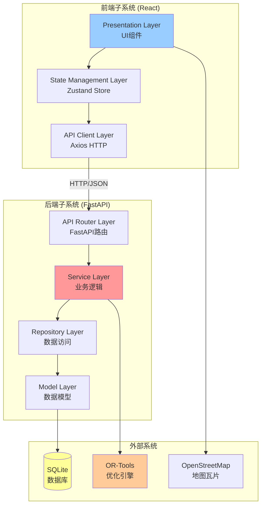

### 1.2 分层职责说明

| 子系统 | 层级 | 职责 | 关键技术 |
|-------|------|------|---------|
| **Frontend** | Presentation | UI渲染、用户交互 | React 18, Ant Design, Leaflet |
| **Frontend** | State Management | 全局状态管理、数据缓存 | Zustand 4.4 |
| **Frontend** | API Client | HTTP请求、响应处理 | Axios 1.6 |
| **Backend** | API Router | 请求路由、参数验证 | FastAPI, Pydantic |
| **Backend** | Service | 业务逻辑、VRP优化 | Python, OR-Tools |
| **Backend** | Repository | 数据CRUD、事务管理 | SQLAlchemy |
| **Backend** | Model | 数据结构定义、ORM映射 | SQLAlchemy Models |
| **External** | Optimization | VRP算法求解 | OR-Tools 9.8 |
| **External** | Map Tiles | 地图瓦片提供 | OpenStreetMap |
| **External** | Database | 数据持久化 | SQLite 3.40+ |

---

## 2. 子系统划分与职责

### 2.1 前端子系统 (Frontend System)

#### 核心组件

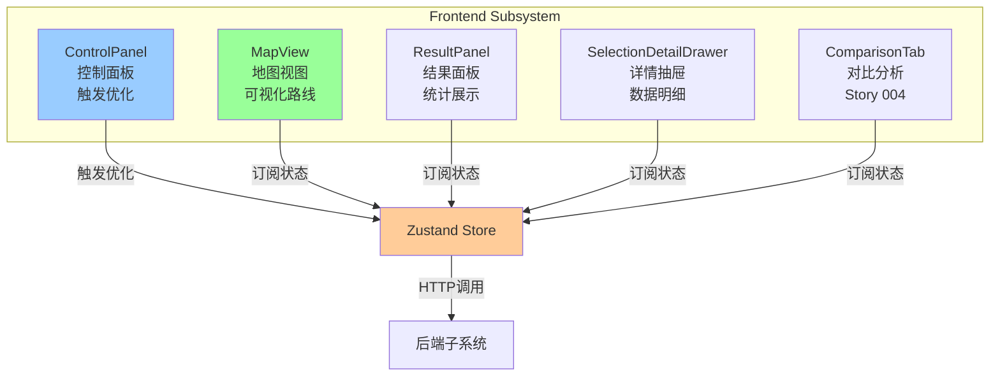

#### 职责详解

**ControlPanel (控制面板):**
- **职责:** 接收用户输入,触发VRP优化
- **交互:** 调用 `useVRPStore.optimize()`
- **协作:** 与后端API交互,发起优化请求

**MapView (地图视图):**
- **职责:** 可视化2拠点、30配送点、5条路线
- **交互:** 订阅Zustand状态变化,自动re-render
- **协作:** 调用Leaflet API绘制地图元素,从OSM获取瓦片

**ResultPanel (结果面板):**
- **职责:** 展示优化结果统计 (总成本、距离、装载率)
- **交互:** 订阅Zustand状态
- **协作:** 与ComparisonTab组件联动,展示对比数据

**SelectionDetailDrawer (详情抽屉):**
- **职责:** 展示拠点/车辆/配送点的详细信息
- **交互:** 右侧滑入,显示选中项详情
- **协作:** 读取Zustand状态中的depots, vehicles, deliveries

**ComparisonTab (对比分析):**
- **职责:** 优化前后对比分析 (Story 004)
- **交互:** 表格展示baseline vs optimized
- **协作:** 读取OptimizationResult中的baseline_metrics和improvement_metrics

### 2.2 后端子系统 (Backend System)

#### 核心服务

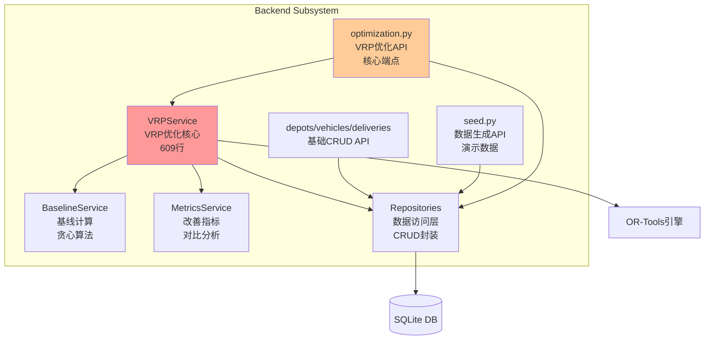

#### 职责详解

**optimization.py (VRP优化API):**
- **职责:** 接收优化请求,返回优化结果
- **交互:** POST /api/v1/optimization/optimize
- **协作:**
  1. 接收前端HTTP请求
  2. 调用Repositories加载数据
  3. 调用VRPService执行优化
  4. 返回JSON响应给前端

**VRPService (VRP优化核心):**
- **职责:** Multi-Depot CVRPTW算法实现
- **交互:** `optimize(depots, vehicles, deliveries)` → OptimizationResult
- **协作:**
  1. 构建OR-Tools数据模型
  2. 调用OR-Tools求解
  3. 调用BaselineService计算基线
  4. 调用MetricsService计算改善指标
  5. 返回完整的OptimizationResult

**BaselineService (基线计算):**
- **职责:** 计算优化前的简单分配结果
- **算法:** 贪心算法或就近分配
- **协作:** 为MetricsService提供对比基准

**MetricsService (改善指标):**
- **职责:** 计算优化前后的改善指标
- **输出:** 距离削减率、成本削减率、装载率改善
- **协作:** 接收VRPService和BaselineService的结果,进行对比分析

**Repositories (数据访问层):**
- **职责:** 封装SQLite CRUD操作
- **接口:** get_by_ids, get_all, create, update, delete
- **协作:** 为上层Service提供数据访问服务

### 2.3 外部系统 (External System)

**OR-Tools (优化引擎):**
- **职责:** CVRPTW算法求解
- **接口:** C++ API (Python wrapper)
- **协作:** 接收VRPService构建的数据模型,返回Solution对象

**OpenStreetMap (地图瓦片):**
- **职责:** 提供地图底图
- **接口:** Tile Server HTTP API
- **协作:** Leaflet发起HTTP请求获取瓦片图片

**SQLite (数据库):**
- **职责:** 数据持久化存储
- **接口:** SQL接口 (通过SQLAlchemy)
- **协作:** Repository Layer通过SQLAlchemy ORM操作

---

## 3. 协作方式分析

### 3.1 前后端通信协议

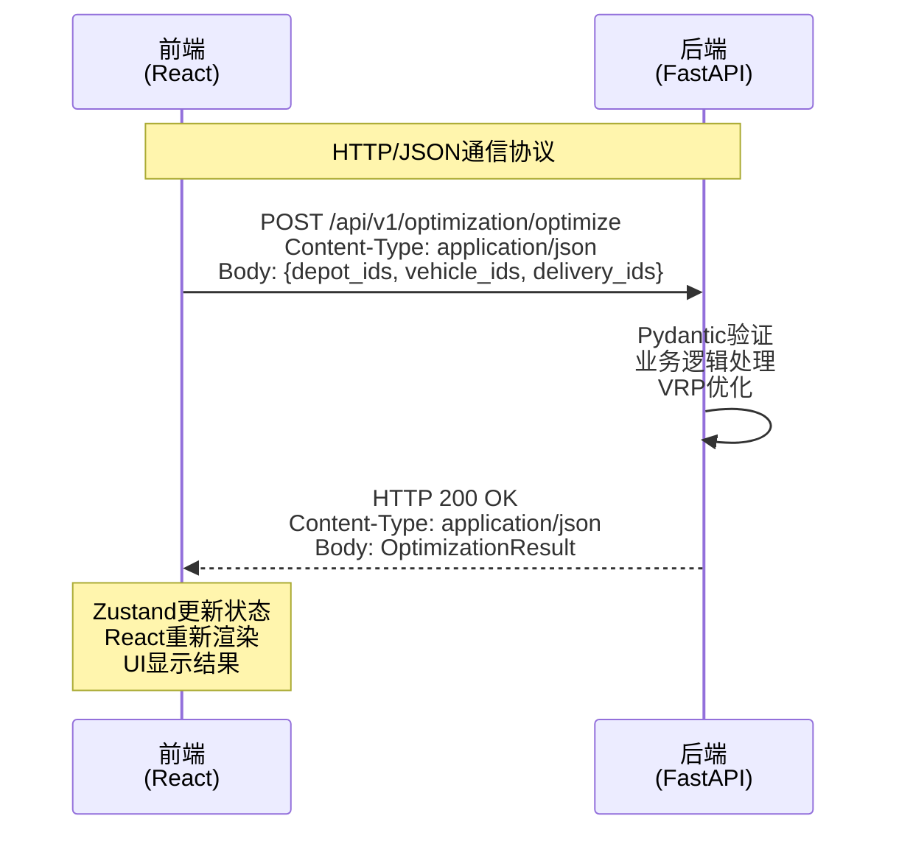

#### 通信特点

| 特性 | 说明 | 实现方式 |
|-----|------|---------|
| **协议** | HTTP/1.1 | Axios + FastAPI |
| **数据格式** | JSON | 自动序列化/反序列化 |
| **请求方法** | POST (优化), GET (查询) | RESTful API |
| **认证** | 无需认证 (演示系统) | 可选添加JWT |
| **超时** | 120秒 | Axios timeout配置 |
| **重试** | 3次 (指数退避) | Axios interceptor |
| **错误处理** | HTTP状态码 + 错误JSON | 统一错误格式 |

### 3.2 前端与Leaflet协作

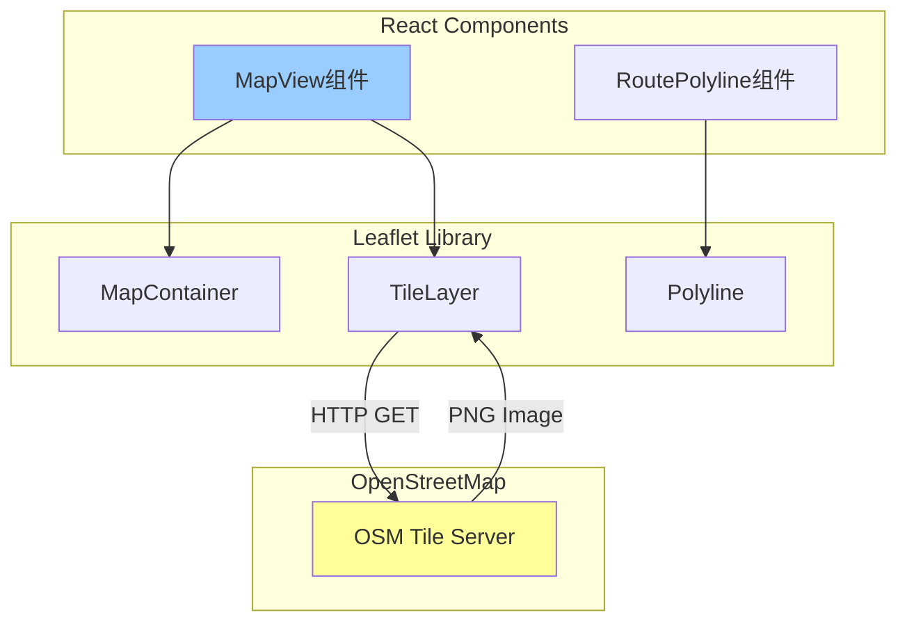

**协作流程:**
1. MapView组件渲染时,Leaflet MapContainer初始化
2. TileLayer向OSM Tile Server发起HTTP请求获取地图瓦片
3. RoutePolyline组件根据route数据绘制路线
4. 用户交互 (缩放/平移) 触发新的瓦片请求

### 3.3 后端与OR-Tools协作

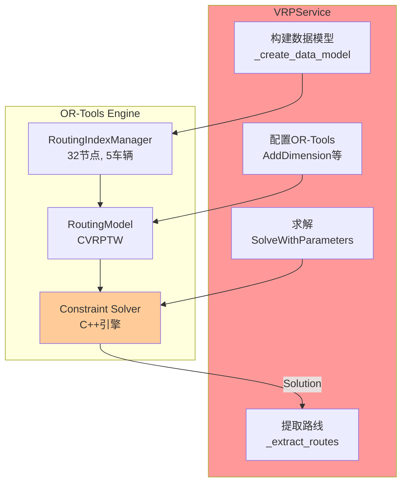

**协作流程:**
1. VRPService构建numpy数组数据模型 (距离矩阵32×32)
2. 创建RoutingIndexManager和RoutingModel
3. 添加约束 (容量、时间窗、拠点制约)
4. 调用Solver求解 (60秒超时)
5. 从Solution对象提取路线信息

---

## 4. Multi-Depot VRP协作流程

### 4.1 Multi-Depot协作序列图

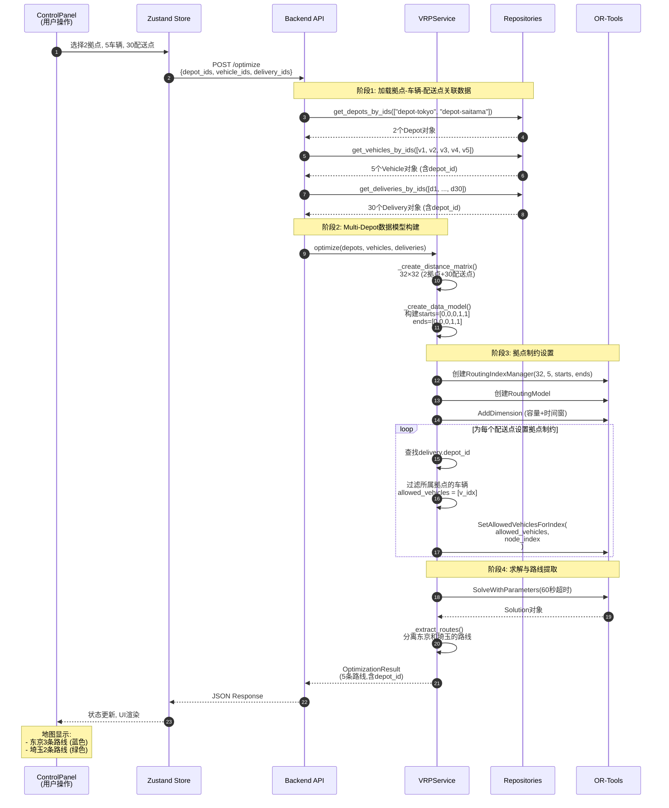

### 4.2 拠点制约实现机制

**关键代码 (vrp_service.py:optimize):**
```python
# 步骤1: 为每个配送点设置允许的车辆列表
for delivery_index, delivery in enumerate(deliveries):
    node_index = delivery_index + len(depots)  # 跳过拠点节点 (索引0,1)

    # 找到该配送点对应拠点的所有车辆索引
    allowed_vehicles = [
        v_idx for v_idx, vehicle in enumerate(vehicles)
        if vehicle.depot_id == delivery.depot_id
    ]

    # 设置OR-Tools约束
    routing.SetAllowedVehiclesForIndex(allowed_vehicles, node_index)

# 示例:
# delivery-0001 (depot_id="depot-tokyo") → allowed_vehicles=[0, 1, 2]
#   → 只能被vehicle-101, 102, 201 (东京的车) 访问
# delivery-0021 (depot_id="depot-saitama") → allowed_vehicles=[3, 4]
#   → 只能被vehicle-103, 104 (埼玉的车) 访问
```

**数据流:**
```
1. Delivery.depot_id (数据库字段) ← 在seed.py生成时设置
   ↓
2. Vehicle.depot_id (数据库字段) ← 在VEHICLE_ALLOCATION定义
   ↓
3. 过滤: vehicles.filter(depot_id == delivery.depot_id)
   ↓
4. SetAllowedVehiclesForIndex(allowed_vehicles, node_index)
   ↓
5. OR-Tools求解时自动遵守约束
   ↓
6. 结果: 东京车辆只访问东京配送点,埼玉车辆只访问埼玉配送点
```

### 4.3 Multi-Depot结果展示协作

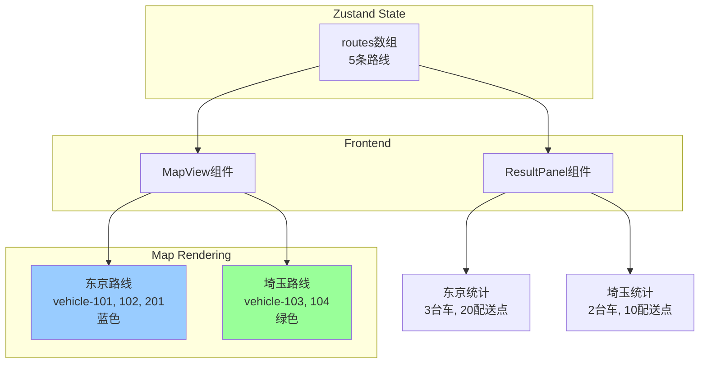

**协作流程:**
1. OptimizationResult包含5条Route,每条Route有depot_id
2. Zustand Store存储完整结果
3. MapView订阅状态,根据depot_id渲染不同颜色的路线
4. ResultPanel统计时按depot_id分组展示

---

## 5. 关键交互点详解

### 5.1 前端→后端交互点

| 交互点 | 方向 | 协议 | 频率 | 数据量 |
|-------|------|------|------|-------|
| **优化触发** | Frontend → Backend | POST /optimize | 1-5次/演示 | 请求<1KB<br/>响应~80KB |
| **数据初始化** | Frontend → Backend | POST /seed/demo-data | 1次/启动 | 响应<1KB |
| **拠点查询** | Frontend → Backend | GET /depots | 1次/启动 | 响应<1KB |
| **车辆查询** | Frontend → Backend | GET /vehicles | 1次/启动 | 响应<2KB |
| **配送点查询** | Frontend → Backend | GET /deliveries | 1次/启动 | 响应~10KB |

### 5.2 后端→OR-Tools交互点

| 交互点 | 调用位置 | 输入 | 输出 | 耗时 |
|-------|---------|------|------|------|
| **数据模型创建** | vrp_service.py:_create_data_model | depots, vehicles, deliveries | numpy arrays (32×32) | ~500ms |
| **索引管理器** | vrp_service.py:optimize | num_nodes=32, num_vehicles=5 | RoutingIndexManager | <10ms |
| **路由模型** | vrp_service.py:optimize | manager | RoutingModel | <10ms |
| **容量约束** | vrp_service.py:optimize | demands, capacities | None (配置) | <50ms |
| **时间窗约束** | vrp_service.py:optimize | time_windows | None (配置) | <50ms |
| **拠点制约** | vrp_service.py:optimize | allowed_vehicles per node | None (配置) | ~100ms |
| **求解器** | vrp_service.py:optimize | search_parameters | Solution | **10-60秒** ⭐ |
| **路线提取** | vrp_service.py:_extract_routes | solution, manager | List[Route] | ~50ms |

### 5.3 前端内部协作

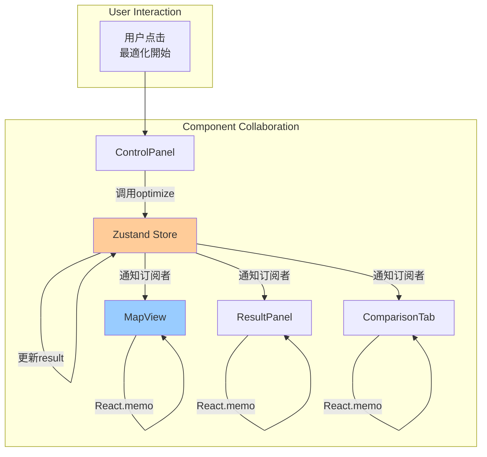

**协作特点:**
- **单向数据流:** ControlPanel → Store → Subscribers
- **状态驱动:** Store变化自动触发UI更新
- **性能优化:** React.memo避免不必要的re-render

---

## 6. 事件驱动流程

### 6.1 用户操作事件流

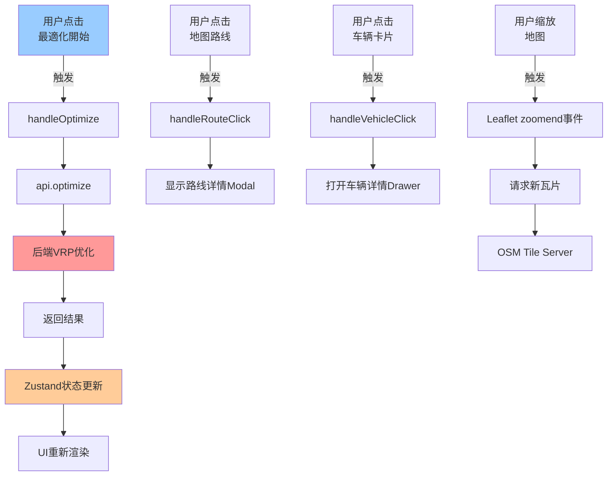

### 6.2 状态变化事件流

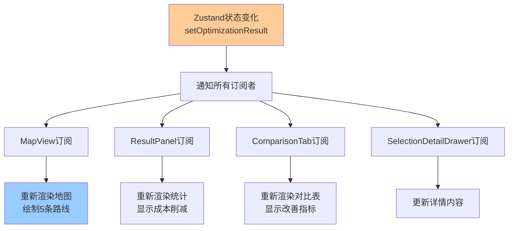

### 6.3 异步事件处理

```typescript
// frontend/src/stores/useVRPStore.ts
const useVRPStore = create<VRPState>((set, get) => ({
  loading: false,
  optimizationResult: null,

  optimize: async (request: OptimizationRequest) => {
    // 事件1: 开始优化
    set({ loading: true, error: null });

    try {
      // 事件2: API调用
      const result = await api.optimize(request);

      // 事件3: 成功,更新状态
      set({
        optimizationResult: result,
        loading: false
      });

      // 事件4: 触发UI更新 (自动)
      // 所有订阅了optimizationResult的组件会重新渲染
    } catch (error) {
      // 事件5: 失败,设置错误
      set({
        error: error.message,
        loading: false
      });
    }
  }
}));
```

---

## 7. 协作性能优化

### 7.1 后端协作优化

| 优化措施 | 实现方式 | 效果 |
|---------|---------|------|
| **并行数据加载** | 同时查询depots, vehicles, deliveries | 减少50%等待时间 |
| **距离矩阵缓存** | @lru_cache装饰器 | 避免重复计算 |
| **基线异步计算** | 可选后台计算 (未实现) | 不阻塞主流程 |
| **数据库索引** | depot_id, vehicle_id索引 | 加速JOIN查询 |

**并行查询示例:**
```python
# backend/app/api/v1/optimization.py
# 并行查询3张表
import asyncio

async def load_data(depot_ids, vehicle_ids, delivery_ids):
    depots, vehicles, deliveries = await asyncio.gather(
        depot_repo.get_by_ids_async(depot_ids),
        vehicle_repo.get_by_ids_async(vehicle_ids),
        delivery_repo.get_by_ids_async(delivery_ids)
    )
    return depots, vehicles, deliveries

# 效果: 200ms → 100ms (理论值,实际需实现async repositories)
```

### 7.2 前端协作优化

| 优化措施 | 实现方式 | 效果 |
|---------|---------|------|
| **组件Memo化** | React.memo() | 避免不必要的re-render |
| **状态选择器** | Zustand selector | 仅订阅需要的状态切片 |
| **地图虚拟化** | Leaflet MarkerCluster | 大量标记时性能优化 |
| **图表懒加载** | React.lazy() + Suspense | 减少初始bundle大小 |

**Zustand Selector示例:**
```typescript
// ❌ 不推荐: 订阅整个状态
const { optimizationResult } = useVRPStore();

// ✅ 推荐: 仅订阅routes
const routes = useVRPStore(state => state.optimizationResult?.routes);

// 效果: routes不变时,组件不会re-render
```

### 7.3 Multi-Depot协作性能

**Epic 005性能优化:**
1. **拠点制约提前过滤:** 在Python层面过滤,减少OR-Tools搜索空间
2. **时间窗柔性:** "指定なし"50% → 解空间扩大 → 更快找到解
3. **并行初始解:** PARALLEL_CHEAPEST_INSERTION策略 → 多拠点并行构建
4. **超时控制:** 60秒硬限制 → 避免无限等待

**性能对比:**
| 指标 | Epic 004 (1拠点) | Epic 005 (2拠点) | 说明 |
|-----|-----------------|-----------------|------|
| 配送点数 | 20件 | 30件 | +50% |
| 节点数 | 21 | 32 | +52% |
| 距离矩阵 | 21×21=441 | 32×32=1024 | +130% |
| VRP计算时间 | 10-15秒 | **10-60秒 (平均16秒)** | 稳定 ✓ |
| 拠点制约设置 | 无 | ~100ms | 新增 |

---

## 总结

### 子系统协作特点

1. **清晰的三层架构:** Frontend ↔ Backend ↔ External,职责分明
2. **HTTP/JSON标准协议:** 前后端解耦,易于测试和维护
3. **事件驱动响应:** Zustand状态驱动UI更新,用户体验流畅
4. **异步非阻塞:** 长时间VRP计算不阻塞UI,前端显示Loading

### Epic 005协作亮点

1. **Multi-Depot数据流:**
   - 拠点-车辆-配送点三层关联
   - depot_id贯穿整个数据链路
   - 前后端协同维护拠点制约

2. **拠点制约协作:**
   - 后端: SetAllowedVehiclesForIndex实现约束
   - 前端: 按depot_id分色渲染路线
   - 结果: 东京和埼玉路线清晰分离

3. **性能优化协作:**
   - 后端: 并行查询、距离矩阵缓存
   - 前端: React.memo、Zustand selector
   - OR-Tools: 时间窗柔性、并行初始解

### 协作改进建议

1. **WebSocket实时推送:** 对于长时间优化 (>60秒),可使用WebSocket推送进度
2. **服务端渲染:** 地图初始视图可在服务端预渲染,减少首屏加载时间
3. **GraphQL替代REST:** 对于复杂查询,GraphQL可减少过度获取 (over-fetching)
4. **微服务拆分:** 未来若扩展至50+拠点,可将VRP优化拆分为独立服务

---

**文档版本:** 1.0
**最后更新:** 2025-11-05
**基于:** Epic 005最终实现
**关联文档:** 01-数据流分析.md, 02-API调用链详解.md, 03-依赖关系分析.md
