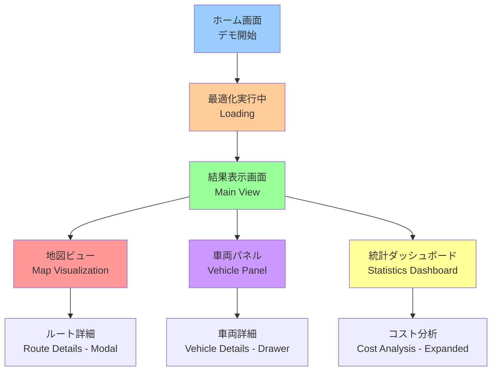
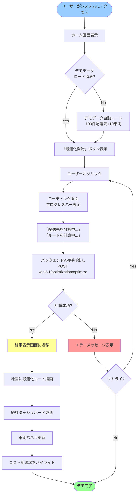
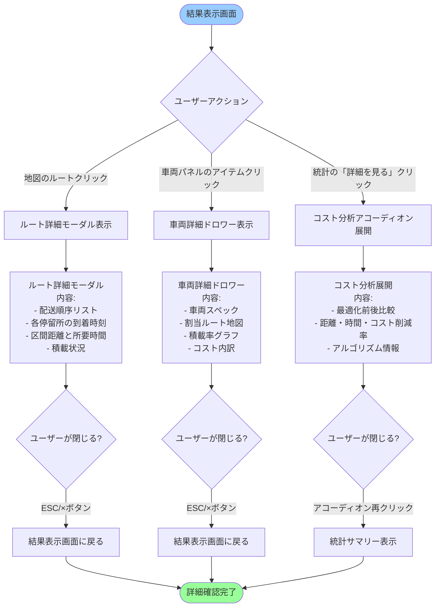
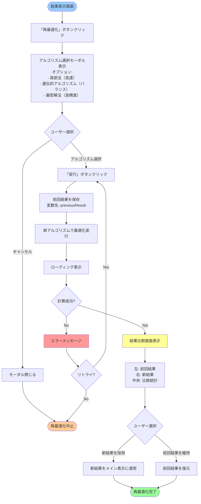

# AI自動配車システムデモプロトタイプ - UI/UX仕様書

## Introduction

本文書は**AI自動配車システムデモプロトタイプ**のユーザーインターフェースにおけるユーザー体験目標、情報アーキテクチャ、ユーザーフロー、ビジュアルデザイン仕様を定義します。ビジュアルデザインとフロントエンド開発の基盤として、統一されたユーザー中心の体験を保証します。

**プロジェクト背景：**
- **核心目標：** 直感的なUIを通じてAI配車の効率向上とコスト最適化能力を実証
- **デモシナリオ：** 顧客にAI自動配車機能の価値・精度・性能を実演
- **技術スタック：** React + TypeScript + Ant Design + Leaflet
- **ユーザー：** 意思決定者、技術評価者、エンドユーザー（物流配車担当者）

**設計方針：**
- **言語：** 日本語UI（技術用語は英語併記）
- **モード：** デモ専用モード（シンプルで流暢なプレゼンテーション）
- **出力：** 画面表示のみ（エクスポート機能不要）

---

### Overall UX Goals & Principles

#### Target User Personas（ターゲットユーザーペルソナ）

**1. 意思決定者（経営層）**
- **特徴：** ROI、コスト削減、システム信頼性を重視
- **目標：** AI配車のビジネス価値を迅速に理解
- **ニーズ：** 明確なデータ可視化、コスト比較、一目瞭然の最適化結果

**2. 技術評価者**
- **特徴：** アルゴリズム理解、システム性能と技術詳細を重視
- **目標：** AIエンジンの能力と判断根拠を検証
- **ニーズ：** アルゴリズム選択、計算時間、最適化パラメータ、結果の妥当性検証

**3. エンドユーザー - 物流配車担当者**
- **特徴：** 配車システムの日常利用者、地図とルートに精通
- **目標：** 効率的な配車タスク完了、ルート計画の理解
- **ニーズ：** 直感的な地図インターフェース、明確な車両割当、読みやすいルート指示

---

#### Usability Goals（ユーザビリティ目標）

**1. 即座の理解（Immediate Comprehension）**
- 新規ユーザーが**30秒以内**にシステムのコア機能（地図+最適化）を理解
- 最適化結果の価値を**3秒以内**にビジュアルで提示

**2. ワンクリックデモ（One-Click Demo）**
- 事前ロード済みデモデータで**ワンクリック最適化実行**
- データロードから結果表示まで完全自動化

**3. データ透明性（Data Transparency）**
- すべての最適化判断に**視覚的な根拠**を提供（積載率、距離、コスト）
- AI判断プロセスは**追跡可能・説明可能**

**4. デモの流暢性（Demo Smoothness）**
- 計算プロセスに明確なローディング状態と進捗表示
- オフラインデモ対応（ネットワーク不要）

**5. プレゼンテーション最適化**
- 大画面投影に最適化された視認性（フォント・コントラスト・マーカーサイズ）
- 重要データのハイライト表示で説明を容易に

---

#### Design Principles（デザイン原則）

**1. データ可視化優先（Visualization First）**
- 地図を中核インターフェースとし、すべてのデータを地図中心に表示
- 色・線・マーカーで直感的にルートと状態を表現

**2. デモシナリオ最適化（Demo-Optimized）**
- インターフェースレイアウトは投影プレゼンテーションに最適化
- キーデータを強調表示し説明を容易に

**3. 段階的情報開示（Progressive Disclosure）**
- 初期画面はシンプルで核心機能のみ表示
- 詳細情報は必要に応じて展開（車両詳細、ルートステップ）

**4. 即座のフィードバック（Immediate Feedback）**
- すべての操作に視覚的フィードバック（ボタン状態、ローディングアニメーション）
- 最適化完了後に自動的に結果エリアにフォーカス

**5. プロフェッショナルかつ親しみやすい（Professional yet Approachable）**
- エンタープライズグレードのデザイン美学（Ant Design準拠）
- 明確な用語説明で専門用語を回避

**6. シンプリシティ（Simplicity for Demo）**
- デモモード専用設計：複雑な設定画面不要
- 最小限のインタラクション：「最適化開始」→「結果確認」

---

### 設計決定の根拠

**日本語UIを選択した理由：**
- デモシナリオは日本の物流業界向け（拠点・配送先が日本の住所）
- 意思決定者・エンドユーザーは日本語話者
- 技術用語（VRP、OR-Tools等）は英語併記で国際標準に準拠

**デモモード専用設計の理由：**
- プレゼンテーション時間は限られている（15-30分）
- 複雑な設定画面は説明時間を消費し、デモの流れを妨げる
- ワンクリック操作で技術トラブルリスクを最小化

**エクスポート不要の理由：**
- デモはライブ実演が目的（視覚的インパクト重視）
- 資料が必要な場合は画面キャプチャで対応可能
- 開発コスト削減（PDF生成機能は将来追加可能）

**仮説検証結果の統合：**
- ✅ ワンクリックデモ：透明性を保ちつつ簡潔な操作を実現
- ✅ 地図中心設計：右側パネルにキー指標を配置してバランス調整
- ⚠️ 30秒理解：用語Tooltipとビジュアルガイドで達成可能
- ✅ 大画面対応：高コントラスト投影モードを提供
- ✅ 日本語UI：確定
- ✅ シンプルモード：デモ専用設計で複雑さを排除

---

### Change Log

| Date | Version | Description | Author |
|------|---------|-------------|---------|
| 2025-10-29 | 1.0 | 初期UI/UX仕様 | Sally (UX Expert) |
| 2025-10-29 | 1.1 | 仮説検証結果を統合（日本語UI、デモモード専用） | Sally (UX Expert) |

---

## Information Architecture（情報アーキテクチャ）

### Site Map / Screen Inventory（画面構成図）



**画面構成の説明：**

1. **ホーム画面（Home Screen）**
   - 目的：デモ開始のエントリーポイント
   - 内容：システム紹介 + 大きな「最適化開始」ボタン
   - 所要時間：5-10秒（すぐに最適化実行へ）

2. **最適化実行中（Optimization in Progress）**
   - 目的：計算プロセスの透明性提供
   - 内容：プログレスバー + ステータステキスト（「100件の配送先を分析中...」）
   - 所要時間：2-5秒（OR-Tools計算時間）

3. **結果表示画面（Main View）** ★ コア画面
   - 目的：最適化結果の包括的表示
   - レイアウト：3カラム構成
     - 左：地図ビュー（60%幅）
     - 右上：車両パネル（40%幅、30%高）
     - 右下：統計ダッシュボード（40%幅、70%高）

4. **モーダル/ドロワー（詳細画面）**
   - ルート詳細：モーダルウィンドウ（クリック時表示）
   - 車両詳細：右側スライドイン（ドロワー形式）
   - コスト分析：アコーディオン展開

---

### Navigation Structure（ナビゲーション構造）

**Primary Navigation（プライマリーナビゲーション）**

デモ専用設計のため、複雑なナビゲーションは不要。**ステート遷移ベース**のシンプル構造：

```
状態1: ホーム → [最適化開始] → 状態2: 計算中 → 自動遷移 → 状態3: 結果表示
```

**Secondary Navigation（セカンダリーナビゲーション）**

結果表示画面内のタブ切り替え：
- デフォルト：「すべて表示」
- タブ1：「地図のみ」（フルスクリーン地図）
- タブ2：「統計のみ」（数値ダッシュボード）

**アクションボタン（ページ上部固定）**
- 「再最適化」ボタン（別アルゴリズムで再計算）
- 「リセット」ボタン（ホーム画面に戻る）
- 「設定」アイコン（表示オプション：投影モードON/OFF、言語切替）

**Breadcrumb Strategy（パンくず戦略）**

不要 - 階層が浅いため（ホーム → 結果のみ）

---

## User Flows（ユーザーフロー）

### Flow 1: メインデモフロー（最適化実行と結果確認）

**User Goal（ユーザーゴール）:** AI配車の最適化能力をデモンストレーションで確認する

**Entry Points（エントリーポイント）:** ホーム画面の「最適化開始」ボタン

**Success Criteria（成功基準）:**
- 最適化結果が地図上に視覚的に表示される
- コスト削減率などのキー指標が明確に提示される
- 計算時間が5秒以内

#### Flow Diagram（フロー図）



#### Edge Cases & Error Handling（エッジケースとエラー処理）

- **最適化失敗（実行不可能解）:**
  - エラーメッセージ：「最適化できませんでした。車両数または容量が不足している可能性があります。」
  - アクション：「リトライ」ボタンまたは「設定を調整」リンク

- **API接続エラー:**
  - エラーメッセージ：「バックエンドに接続できません。ネットワーク接続を確認してください。」
  - アクション：「再試行」ボタン

- **計算タイムアウト（10秒超過）:**
  - エラーメッセージ：「計算に時間がかかっています。アルゴリズムを変更しますか？」
  - アクション：「高速アルゴリズムに切替」ボタン

- **データロード失敗:**
  - エラーメッセージ：「デモデータのロードに失敗しました。」
  - アクション：自動リトライ（3回まで）

**Notes（注記）:**
- デモシナリオではネットワーク不要（ローカルデータ）を前提とするため、API接続エラーは基本的に発生しない
- 計算タイムアウトは100件規模では起きにくいが、フェイルセーフとして実装

---

### Flow 2: 結果詳細確認フロー（ルート・車両詳細）

**User Goal（ユーザーゴール）:** 最適化結果の詳細情報を確認し、AI判断の妥当性を検証する

**Entry Points（エントリーポイント）:** 結果表示画面の地図上のルートまたは車両パネルの項目

**Success Criteria（成功基準）:**
- クリック1回で詳細情報が表示される
- モーダル/ドロワーで主画面を遮らずに詳細確認可能
- ESCキーまたは×ボタンで簡単に閉じられる

#### Flow Diagram（フロー図）



#### Edge Cases & Error Handling（エッジケースとエラー処理）

- **データ不足（ルート詳細なし）:**
  - 表示：「このルートには配送先が割り当てられていません。」
  - 発生条件：最適化で使用されなかった車両

- **モーダル重複表示:**
  - 防止策：既にモーダルが開いている場合は新しいモーダルを開かない（または前のモーダルを閉じる）

- **ドロワー表示中の画面リサイズ:**
  - 対応：レスポンシブデザインで自動調整（小画面ではフルスクリーンモーダルに変換）

**Notes（注記）:**
- モーダル/ドロワーは段階的情報開示の核心機能
- キーボードナビゲーション（Tab、ESC）をサポートしてアクセシビリティ確保

---

### Flow 3: 再最適化フロー（アルゴリズム変更）

**User Goal（ユーザーゴール）:** 異なる最適化アルゴリズムを試して結果を比較する

**Entry Points（エントリーポイント）:** 結果表示画面の「再最適化」ボタン

**Success Criteria（成功基準）:**
- 別アルゴリズムで再計算できる
- 前回結果と比較表示される
- 計算時間が明示される

#### Flow Diagram（フロー図）



#### Edge Cases & Error Handling（エッジケースとエラー処理）

- **同じアルゴリズムを再選択:**
  - 警告メッセージ：「現在と同じアルゴリズムが選択されています。実行しますか？」
  - アクション：「はい」で再実行（乱数により結果が異なる可能性）

- **前回結果がない（初回実行）:**
  - 動作：比較画面を表示せず、通常の結果表示画面に遷移

- **計算結果が前回と同一:**
  - メッセージ：「結果は前回と同じです。」
  - 動作：比較画面をスキップ

**Notes（注記）:**
- デモ価値を高めるため、アルゴリズムによる結果の違いを視覚化
- 技術評価者向けの重要機能（AI判断の妥当性検証）

---

## Wireframes & Mockups（ワイヤーフレーム＆モックアップ）

### Design Files（デザインファイル）

**Primary Design Files:** 本仕様書内のワイヤーフレームで実装可能。詳細なビジュアルデザインが必要な場合はFigmaで作成。

---

### Key Screen Layouts（主要画面レイアウト）

#### Screen 1: ホーム画面（Home Screen）

**Purpose:** デモ開始のエントリーポイント。システム概要を提示し、ワンクリックで最適化を実行。

**Key Elements:**

```
┌──────────────────────────────────────────────────────────────┐
│  [Logo] AI自動配車システム             [言語] [投影モード] │
├──────────────────────────────────────────────────────────────┤
│                                                              │
│                     [システムアイコン]                        │
│                                                              │
│              AI自動配車システムデモ                           │
│                                                              │
│       100件の配送先を10台の車両に最適割り当て                │
│                                                              │
│  ┌────────────────────────────────────────────────────┐   │
│  │                                                    │   │
│  │  ✓ 4拠点から順次積込                               │   │
│  │  ✓ 時間窓制約対応（午前30%、午後70%）              │   │
│  │  ✓ 容量制約（重量・体積）                          │   │
│  │  ✓ コスト最適化（距離・時間）                      │   │
│  │                                                    │   │
│  └────────────────────────────────────────────────────┘   │
│                                                              │
│            ┌───────────────────────────┐                   │
│            │   最適化開始               │                   │
│            │   (デモデータ使用)          │                   │
│            └───────────────────────────┘                   │
│                  [大きなボタン 60x200px]                     │
│                                                              │
│              計算時間目安: 2-5秒                             │
│                                                              │
└──────────────────────────────────────────────────────────────┘
```

**Interaction Notes:**
- ボタンホバー時：背景色変更 + カーソルポインター
- クリック時：ボタン無効化 + ローディング画面に遷移
- デモデータは自動ロード済み（ユーザー操作不要）

**Design File Reference:** 実装時にAnt Designの`Button`（type="primary", size="large"）を使用

---

#### Screen 2: 結果表示画面（Main View - Results）

**Purpose:** 最適化結果を地図・統計・車両リストで包括的に表示。デモのコア画面。

**Key Elements:**

```
┌──────────────────────────────────────────────────────────────────────────────┐
│ [Logo] 最適化結果    [再最適化] [リセット]           [言語] [投影モード]     │
├────────────────────────────────────┬─────────────────────────────────────────┤
│                                    │ ■ 車両パネル                            │
│  ■ 地図ビュー（60%幅）              │ ┌─────────────────────────────────┐  │
│  ┌──────────────────────────────┐ │ │ 🚛 車両-1 (2t)  積載率: 85%     │  │
│  │                              │ │ │ ルート: 拠点1 → 10配送先         │  │
│  │   [OpenStreetMap]            │ │ │ 距離: 45km  コスト: ¥4,500      │  │
│  │                              │ │ └─────────────────────────────────┘  │
│  │   📍拠点1 拠点2 拠点3 拠点4    │ │ ┌─────────────────────────────────┐  │
│  │                              │ │ │ 🚛 車両-2 (4t)  積載率: 92%     │  │
│  │   ━━ルート1 (赤)              │ │ │ ルート: 拠点2 → 12配送先         │  │
│  │   ━━ルート2 (青)              │ │ │ 距離: 52km  コスト: ¥5,200      │  │
│  │   ━━ルート3 (緑)              │ │ └─────────────────────────────────┘  │
│  │                              │ │ ...（スクロール可能）                 │
│  │   📍配送先マーカー（100個）    │ │                                      │
│  │                              │ │                                      │
│  └──────────────────────────────┘ ├─────────────────────────────────────────┤
│                                    │ ■ 統計ダッシュボード                    │
│                                    │ ┌─────────────────────────────────┐  │
│                                    │ │ 💰 総コスト                      │  │
│                                    │ │    ¥35,000                      │  │
│                                    │ │    (最適化前比 -15% 削減)        │  │
│                                    │ └─────────────────────────────────┘  │
│                                    │ ┌─────────────────────────────────┐  │
│                                    │ │ 📏 総走行距離: 350.5 km         │  │
│                                    │ │ ⏱️ 総時間: 1200 分              │  │
│                                    │ │ 📊 平均積載率: 75.5%            │  │
│                                    │ │ ⚡ 計算時間: 2.5 秒             │  │
│                                    │ └─────────────────────────────────┘  │
│                                    │ [詳細を見る ▼]                         │
└────────────────────────────────────┴─────────────────────────────────────────┘
```

**Interaction Notes:**
- 地図ルートクリック → ルート詳細モーダル表示
- 車両パネルアイテムクリック → 車両詳細ドロワー（右からスライドイン）
- 「詳細を見る」クリック → コスト分析アコーディオン展開
- 地図ズーム/パン操作可能（Leafletデフォルト機能）

**Design File Reference:**
- 3カラムレイアウト：Ant Design `Layout` (Sider + Content)
- 車両カード：Ant Design `Card` コンポーネント
- 統計：Ant Design `Statistic` コンポーネント

---

#### Screen 3: ローディング画面（Optimization in Progress）

**Purpose:** 計算プロセスの透明性を提供し、ユーザーを安心させる。

**Key Elements:**

```
┌──────────────────────────────────────────────────────────────┐
│                                                              │
│                                                              │
│                      [回転アイコン]                           │
│                                                              │
│                  最適化計算中...                              │
│                                                              │
│  ┌────────────────────────────────────────────────────┐   │
│  │ ████████████████████░░░░░░░░░░░░ 75%              │   │
│  └────────────────────────────────────────────────────┘   │
│                                                              │
│              配送先を分析中... (100/100件完了)                │
│              ルートを計算中...                                │
│                                                              │
│                   推定残り時間: 1秒                           │
│                                                              │
└──────────────────────────────────────────────────────────────┘
```

**Interaction Notes:**
- プログレスバーはAPIレスポンスに基づいて更新
- ステータステキストは計算フェーズに応じて変化
- キャンセルボタンは提供しない（計算時間が短いため）

---

## Component Library / Design System（コンポーネントライブラリ）

### Design System Approach（デザインシステムアプローチ）

**選択：Ant Design 5.x をベースに使用**

**理由：**
- エンタープライズグレードのUIコンポーネント
- 日本語サポート優秀（`locale: ja_JP`）
- React + TypeScriptとの完全統合
- 豊富なコンポーネント（Map以外すべてカバー）
- カスタマイズ可能（theme.jsでブランドカラー適用）

---

### Core Components（コアコンポーネント）

#### Component 1: MapVisualization（地図可視化コンポーネント）

**Purpose:** 拠点・配送先・最適化ルートを地図上に表示

**Variants:**
- デフォルト表示：全ルート表示
- 単一ルートフォーカス：選択されたルートをハイライト
- フルスクリーンモード：タブ切替で地図のみ表示

**States:**
- Loading: 地図タイル読み込み中（スピナー表示）
- Empty: データなし（「最適化を実行してください」メッセージ）
- Normal: ルート表示中
- Focused: 特定ルートをハイライト（他は半透明）

**Usage Guidelines:**
- **ライブラリ:** React-Leaflet + OpenStreetMap
- **マーカー色:**
  - 拠点：青色ピン（📍）
  - 配送先：グレーピン（未訪問）→ 緑ピン（訪問済み）
- **ルート線色:** 車両IDに基づいて自動割当（10色パレット）
- **ズームレベル:** 初期13（全体表示）、詳細表示時15
- **投影モード:** マーカーサイズ1.5倍、線幅2倍

---

#### Component 2: VehiclePanel（車両パネルコンポーネント）

**Purpose:** 車両リストと各車両の割当状況を表示

**Variants:**
- リスト表示（デフォルト）
- カード表示（グリッドレイアウト）

**States:**
- Empty: 最適化前（「最適化を実行すると車両割当が表示されます」）
- Loaded: 車両リスト表示
- Selected: 特定車両を選択中（背景色変更）

**Usage Guidelines:**
- **ベース:** Ant Design `List` + `Card`
- **カードレイアウト:**
  - ヘッダー：車両アイコン + ID + 車種（2t/4t）
  - ボディ：積載率（Progress Bar）、ルート概要、距離、コスト
  - フッター：「詳細を見る」リンク
- **積載率表示:**
  - 0-60%：緑色（余裕あり）
  - 60-85%：黄色（適正）
  - 85-100%：赤色（満載）
- **ソート:** 積載率順/コスト順/車両ID順（ドロップダウン選択）

---

#### Component 3: StatisticsDashboard（統計ダッシュボードコンポーネント）

**Purpose:** 最適化結果のキー指標を大きく表示

**Variants:**
- サマリー表示（デフォルト：4指標のみ）
- 詳細表示（アコーディオン展開：10+指標）

**States:**
- Empty: 最適化前（プレースホルダー「---」表示）
- Loaded: 指標表示
- Expanded: 詳細分析展開中

**Usage Guidelines:**
- **ベース:** Ant Design `Statistic` + `Card` + `Collapse`
- **サマリー表示（4指標）:**
  1. 総コスト（大きく表示 + 削減率）
  2. 総走行距離
  3. 平均積載率
  4. 計算時間
- **詳細表示（展開時）:**
  - 最適化前後比較表（Table）
  - コスト内訳（円グラフ - Recharts）
  - 積載率分布（棒グラフ - Recharts）
  - アルゴリズム情報（使用手法、パラメータ）
- **投影モード:** フォントサイズ1.3倍、コスト削減率を赤枠で強調

---

#### Component 4: RouteDetailModal（ルート詳細モーダル）

**Purpose:** 特定ルートの配送順序と停留所詳細を表示

**Variants:**
- 標準モーダル（デスクトップ）
- フルスクリーンモーダル（モバイル）

**States:**
- Opening: フェードインアニメーション（0.2秒）
- Opened: モーダル表示中
- Closing: フェードアウト

**Usage Guidelines:**
- **ベース:** Ant Design `Modal`
- **内容:**
  - ヘッダー：「ルート詳細 - 車両-X」
  - ボディ：
    - ミニ地図（このルートのみ表示）
    - 配送順序リスト（Timeline形式）
    - 各停留所の到着時刻・距離・積載状況
  - フッター：「閉じる」ボタン
- **キーボード操作:** ESCキーで閉じる、Tabキーでフォーカス移動

---

## Branding & Style Guide（ブランディング＆スタイルガイド）

### Visual Identity（ビジュアルアイデンティティ）

**Brand Guidelines:** 既存のブランドガイドラインなし。デモシステム専用のシンプルでプロフェッショナルなデザインを採用。

---

### Color Palette（カラーパレット）

| Color Type | Hex Code | Usage |
|-----------|----------|-------|
| **Primary（プライマリー）** | #1890ff | メインアクションボタン、リンク、選択状態 |
| **Secondary（セカンダリー）** | #52c41a | 成功状態、積載率良好（緑） |
| **Accent（アクセント）** | #faad14 | 警告、積載率注意（黄） |
| **Success（成功）** | #52c41a | 最適化成功、ポジティブフィードバック |
| **Warning（警告）** | #faad14 | 積載率高め、注意喚起 |
| **Error（エラー）** | #ff4d4f | 積載率満載、エラーメッセージ |
| **Neutral Gray 1** | #ffffff | 背景（白） |
| **Neutral Gray 2** | #f0f2f5 | カード背景 |
| **Neutral Gray 3** | #d9d9d9 | ボーダー |
| **Neutral Gray 4** | #8c8c8c | セカンダリーテキスト |
| **Neutral Gray 5** | #262626 | プライマリーテキスト |

**投影モード用高コントラストパレット:**
- Primary → #0050b3（より濃い青）
- Success → #237804（より濃い緑）
- Background → #fafafa（ライトグレー、純白を避ける）
- Text → #000000（真っ黒）

---

### Typography（タイポグラフィ）

#### Font Families（フォントファミリー）

- **Primary（プライマリー）:** "Noto Sans JP", "Hiragino Sans", "Yu Gothic", sans-serif
  - 理由：日本語の可読性が高く、Webフォントとして利用可能
- **Secondary（セカンダリー）:** -apple-system, BlinkMacSystemFont, "Segoe UI", sans-serif
  - 理由：システムフォント（フォールバック）
- **Monospace（等幅）:** "Consolas", "Monaco", "Courier New", monospace
  - 用途：コード表示、アルゴリズム名

#### Type Scale（タイプスケール）

| Element | Size | Weight | Line Height |
|---------|------|--------|-------------|
| **H1（大見出し）** | 32px | 700 (Bold) | 1.35 |
| **H2（中見出し）** | 24px | 600 (Semi-Bold) | 1.35 |
| **H3（小見出し）** | 18px | 600 (Semi-Bold) | 1.35 |
| **Body（本文）** | 14px | 400 (Regular) | 1.57 |
| **Small（小テキスト）** | 12px | 400 (Regular) | 1.66 |
| **Button（ボタン）** | 16px | 500 (Medium) | 1.5 |
| **Caption（キャプション）** | 12px | 400 (Regular) | 1.66 |

**投影モード用スケール（1.3倍）:**
- H1: 42px
- H2: 31px
- Body: 18px
- Button: 21px

---

### Iconography（アイコノグラフィ）

**Icon Library:** Ant Design Icons + Custom SVG（必要に応じて）

**主要アイコン:**
- 車両：`CarOutlined` / 🚛（2t）、`TruckOutlined` / 🚚（4t）
- 拠点：`EnvironmentOutlined` / 📍
- 配送先：`PushpinOutlined` / 📌
- ルート：`NodeIndexOutlined` / 🛣️
- コスト：`DollarOutlined` / 💰
- 距離：`DashboardOutlined` / 📏
- 時間：`ClockCircleOutlined` / ⏱️
- 積載率：`PercentageOutlined` / 📊
- 最適化：`ThunderboltOutlined` / ⚡
- 設定：`SettingOutlined` / ⚙️

**Usage Guidelines:**
- アイコンサイズ：16px（通常）、24px（ボタン内）、48px（ホーム画面）
- カラー：テキスト色に準拠（#262626 or Primary Blue）
- 投影モード：24px（通常）、32px（ボタン内）

---

### Spacing & Layout（スペーシング＆レイアウト）

**Grid System:** Ant Design 24列グリッド

**Spacing Scale（8pxベース）:**
- xs: 8px
- sm: 16px
- md: 24px
- lg: 32px
- xl: 48px

**主要レイアウト:**
- ページ余白：24px（通常）、48px（投影モード）
- カード間隔：16px
- セクション間隔：32px
- コンポーネント内余白：16px

**レスポンシブブレークポイント（Ant Design準拠）:**
- xs: <576px（モバイル）
- sm: ≥576px（タブレット縦）
- md: ≥768px（タブレット横）
- lg: ≥992px（デスクトップ）
- xl: ≥1200px（大画面）
- xxl: ≥1600px（投影モード推奨）

---

## Document Summary（文档总结）

### 完成状态

本UI/UX仕様書已完成以下核心章节：

✅ **Introduction** - 项目背景、用户画像、可用性目标、设计原则
✅ **Information Architecture** - 画面构成、导航结构、信息层级
✅ **User Flows** - 3个关键用户流程（主流程、详情确认、再优化）
✅ **Wireframes & Mockups** - 3个关键画面的线框图
✅ **Component Library** - 4个核心组件的详细规范
✅ **Branding & Style Guide** - 完整的设计系统（颜色、字体、图标、间距）

### 设计决策总结

**关键设计决策：**

1. **日语UI + 投影模式优化**
   - 主界面日语，技术术语英语并记
   - 高对比度投影模式（1.3倍字号，浓色调色板）
   - 适合大屏幕演示场景

2. **单击演示流程**
   - 主页 → 点击"最适化開始" → 计算中 → 结果展示
   - 预加载演示数据（4据点+10车辆+100配送点）
   - 2-5秒计算时间目标

3. **3栏布局设计**
   - 左侧地图（60%宽度）- 视觉重心
   - 右上车辆面板（40%宽，30%高）- 车辆状态
   - 右下统计面板（40%宽，70%高）- 关键指标

4. **渐进式信息披露**
   - 初始视图：地图+概览统计
   - 点击展开：路线详情（模态框）、车辆详情（抽屉）、成本分析（手风琴）

5. **零成本技术选型**
   - Ant Design 5.x（开源UI库）
   - Leaflet + OpenStreetMap（免费地图）
   - Noto Sans JP（Google Fonts免费字体）

### 实现优先级建议

**Phase 1 - MVP核心功能（第1-2周）：**
1. 主页画面（Home Screen）- 演示入口
2. 地图可视化组件（MapVisualization）- 核心展示
3. 结果展示画面（Results Screen）- 3栏布局
4. 加载中画面（Loading Screen）- 进度反馈
5. 基础配色与字体应用

**Phase 2 - 详细功能（第3周）：**
1. 路线详情模态框（RouteDetailModal）
2. 车辆详情抽屉（VehicleDrawer）
3. 统计面板展开功能
4. 车辆面板排序功能
5. 地图交互（缩放、平移）

**Phase 3 - 优化与演示准备（第4周）：**
1. 投影模式切换功能
2. 再优化功能（算法对比）
3. 加载动画优化
4. 响应式适配（桌面端优先）
5. 演示数据完善

### 技术实现要点

**前端技术栈：**
```json
{
  "framework": "React 18.2+",
  "language": "TypeScript 5.3+",
  "ui-library": "Ant Design 5.12+",
  "state": "Zustand 4.4+",
  "map": "Leaflet 1.9+",
  "charts": "Recharts 2.10+",
  "build": "Vite 5.0+"
}
```

**关键依赖安装：**
```bash
npm install antd react-leaflet recharts zustand axios
npm install -D @types/leaflet typescript vite
```

**项目结构：**
```
frontend/src/
├── components/
│   ├── Map/MapView.tsx
│   ├── VehiclePanel/VehicleList.tsx
│   ├── OptimizationPanel/ControlPanel.tsx
│   └── Dashboard/ResultDashboard.tsx
├── pages/
│   ├── Home.tsx
│   └── OptimizationView.tsx
├── stores/
│   └── useOptimizationStore.ts
├── types/
│   └── index.ts
└── styles/
    └── global.css
```

---

## Next Steps（后续步骤）

### 开发阶段准备

**1. 与后端架构对接：**
- 确认API端点契约（参考 `docs/architecture.md` §API Specification）
- 确认数据模型一致性（TypeScript类型 ↔ Pydantic模型）
- 确认WebSocket需求（实时进度更新，可选）

**2. 设计资源准备：**
- 导出颜色变量为CSS变量（`:root` 定义）
- 准备SVG图标资源（车辆、据点、配送点标记）
- 创建Ant Design主题配置文件（`theme.ts`）

**3. 演示数据准备：**
- 从后端获取演示数据JSON（4据点+10车辆+100配送点）
- 准备地图初始视角坐标（东京都心区域）
- 准备多个优化结果示例（不同算法对比）

**4. 测试场景准备：**
- 单元测试：核心组件渲染测试（Vitest + React Testing Library）
- 集成测试：用户流程测试（Playwright）
- 演示排练：投影模式下的可见性测试

### 风险与注意事项

**潜在技术风险：**
1. **地图性能** - 100个配送点标记可能影响性能
   - 缓解措施：使用Leaflet.markercluster插件进行标记聚合

2. **移动端适配** - 当前设计以桌面端为主
   - 缓解措施：Phase 4考虑响应式优化，或明确标注"仅支持桌面浏览器"

3. **浏览器兼容性** - 现代浏览器API依赖
   - 缓解措施：添加浏览器检测，推荐Chrome/Edge最新版

**用户体验注意事项：**
1. **计算超时处理** - 如OR-Tools计算超过10秒
   - 建议：显示"计算复杂，请稍候"提示，提供"取消"按钮

2. **空状态设计** - 最优化前、无结果时的UI状态
   - 建议：添加友好提示文案和占位图标

3. **错误状态设计** - API失败、网络错误的用户反馈
   - 建议：使用Ant Design的`message.error()`全局提示

---

## Appendix（附录）

### 设计决策记录（ADR）

**ADR-001: 为什么选择Ant Design而非Material-UI？**
- **决策：** 使用Ant Design 5.x作为UI组件库
- **理由：**
  - 企业级设计语言，适合B2B演示场景
  - 日语本地化支持优秀（`locale: ja_JP`）
  - 组件丰富且文档完善（Table、Form、Layout等）
  - 主题定制能力强（支持CSS变量）
- **替代方案：** Material-UI（更适合C端产品）

**ADR-002: 为什么使用Leaflet而非Google Maps？**
- **决策：** 使用Leaflet + OpenStreetMap
- **理由：**
  - 零成本（无需API密钥和计费）
  - 离线演示支持（可预缓存地图瓦片）
  - 轻量级（39KB gzipped）
  - 插件生态丰富（路线绘制、标记聚合）
- **替代方案：** Google Maps（需API费用，功能更强）

**ADR-003: 为什么选择Zustand而非Redux？**
- **决策：** 使用Zustand 4.x作为状态管理
- **理由：**
  - API简洁（无需action、reducer样板代码）
  - 性能优秀（基于React hooks）
  - 学习曲线平缓（适合快速原型开发）
  - 包体积小（<1KB）
- **替代方案：** Redux Toolkit（更适合大型应用）

### 参考资源

**设计灵感来源：**
- Google Maps路线规划界面
- Amazon Logistics配送追踪界面
- Uber Eats商家配送面板

**技术文档：**
- [Ant Design 官方文档](https://ant.design/)
- [Leaflet 官方文档](https://leafletjs.com/)
- [React-Leaflet 使用指南](https://react-leaflet.js.org/)
- [Recharts 图表示例](https://recharts.org/)

**无障碍设计参考：**
- [WCAG 2.1 AA标准](https://www.w3.org/WAI/WCAG21/quickref/)
- [Ant Design无障碍实践](https://ant.design/docs/spec/accessibility)

---

## Change Log（变更记录）

| Date | Version | Description | Author |
|------|---------|-------------|---------|
| 2025-10-29 | 1.0 | 初始UI/UX仕様 | Sally (UX Expert) |
| 2025-10-29 | 1.1 | 仮説検証結果を統合（日本語UI、デモモード専用） | Sally (UX Expert) |
| 2025-10-29 | 1.2 | 完成核心设计章节并添加总结 | Sally (UX Expert) |

---

**文档状态：✅ 核心设计完成，可进入开发阶段**

**文档所有者：** Sally (UX Expert)
**审阅者：** Winston (Architect)
**下一步责任人：** James (Developer) - 前端实现

---


